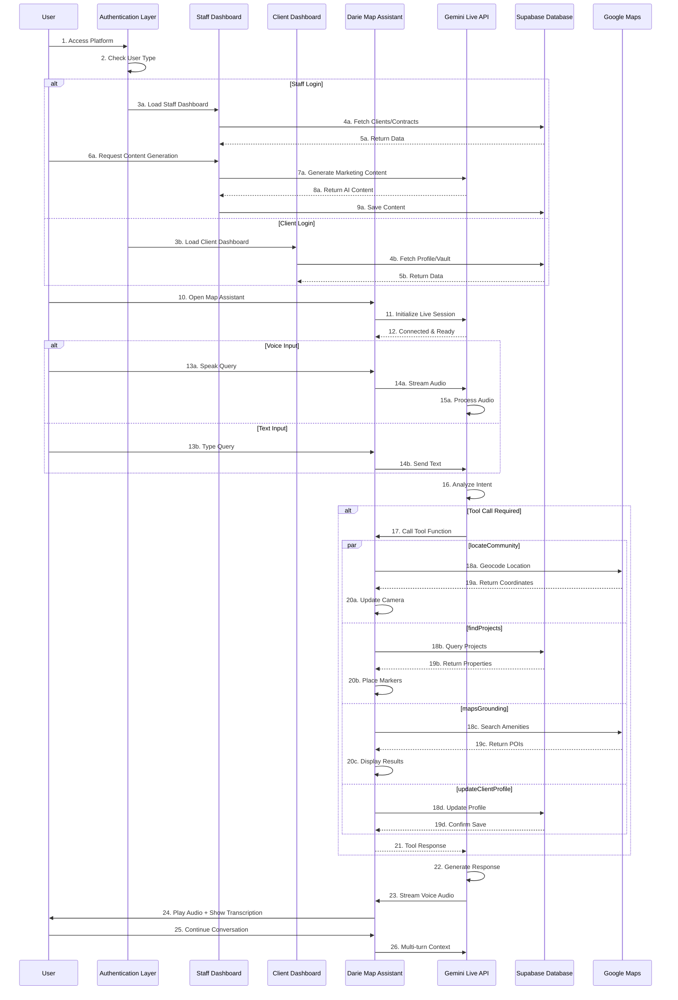
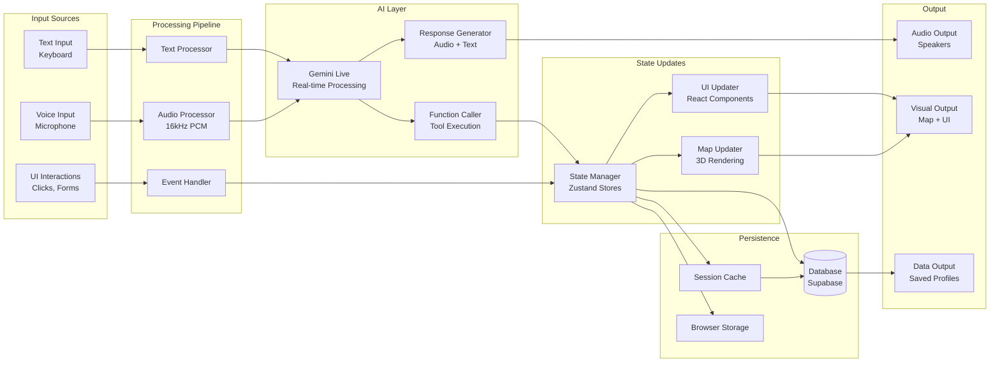
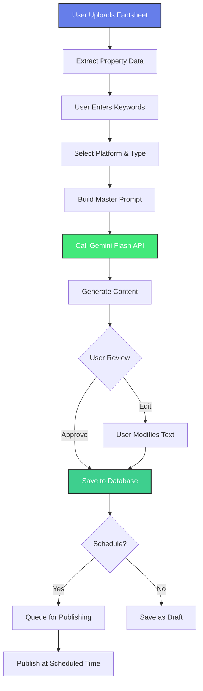
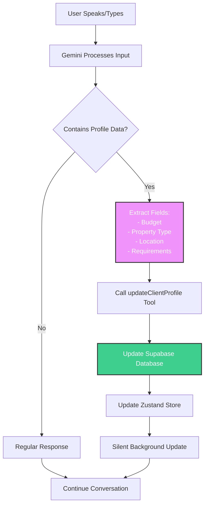

# 🏢🤖 DarieAI - System Overview & Architecture

> **Enterprise-grade AI-powered real estate management platform combining intelligent property management with voice-driven conversational 3D exploration**

[](https://react.dev/)
[](https://www.typescriptlang.org/)
[](https://vitejs.dev/)
[](https://ai.google.dev/)
[](https://developers.google.com/maps)
[](https://supabase.com/)

---

## 📋 Table of Contents

- [Overview](#-overview)
- [Key Highlights](#-key-highlights)
- [System Architecture](#-system-architecture)
- [Component Architecture](#-component-architecture)
- [Data Flow Architecture](#-data-flow-architecture)
- [Technology Stack](#-technology-stack)

---

## 🎯 Overview

**DarieAI** is a comprehensive, production-ready AI-powered real estate platform that unifies property management, client relationship management, AI-driven content creation, and immersive 3D property exploration into a single integrated system. The platform transforms traditional real estate operations through intelligent automation and conversational AI.

### What Makes DarieAI Unique?

DarieAI combines two powerful applications into one unified platform:

1. **DarieAI Management Platform** - A full-featured real estate CRM with:
   - Staff dashboard for property advisors, admins, and owners
   - Client management system
   - AI-powered content generation
   - Contract management
   - Market intelligence tools

2. **Darie Map Assistant** - A voice-driven 3D property exploration tool with:
   - Real-time conversational AI (Google Gemini Live)
   - Photorealistic 3D maps (Google Maps Platform)
   - Voice-controlled navigation
   - Intelligent property search
   - Automated client profile extraction

### Integration Benefits

- **Single Sign-On**: One login for all features
- **Unified Data**: Client profiles sync across both systems
- **Seamless Navigation**: Tab-based switching between management and exploration
- **Consistent Experience**: Same design language and user flow
- **Shared Intelligence**: AI learns from both management and conversation data

---

## 🌟 Key Highlights

### Integrated Platform Features

**Dual-Interface System**
- Staff dashboard for property management operations
- Client portal for end-users
- Darie Map Assistant accessible from both interfaces
- Role-based access control

**Voice-Driven 3D Map Assistant**
- Conversational property exploration with Google Gemini Live API
- Real-time speech-to-text and text-to-speech
- Multi-turn contextual conversations
- Hands-free operation

**AI Content Studio**
- Automated marketing content generation for social media
- Property description writing
- Multi-platform support (Instagram, Facebook, LinkedIn)
- Template-based generation with customization

**Client Management System**
- Comprehensive CRM with profile tracking
- Interaction history and notes
- Document management and vault
- Communication hub (email, SMS, in-app)

**Market Intelligence**
- AI-powered property valuations
- Market trend analysis
- Area comparison tools
- Developer insights

**Contract Management**
- Digital contract creation and tracking
- Multi-party workflows
- Status monitoring
- Audit trails

**Vault System**
- Secure document storage
- Categorization and tagging
- Version control
- Sharing capabilities

### Technical Excellence

**Modern React 19**
- Latest React features and Concurrent Mode
- TypeScript for type safety
- Vite for lightning-fast builds
- Hot Module Replacement (HMR)

**Real-time Voice AI**
- Gemini Live API with native audio streaming
- 16kHz PCM audio processing
- Low-latency voice responses (<500ms)
- Multi-turn conversation context

**3D Visualization**
- Photorealistic Google Maps 3D rendering
- WebGL 2 powered graphics
- Smooth camera animations
- Dynamic marker placement

**Secure Backend**
- Supabase with PostgreSQL
- Row-Level Security (RLS)
- Encrypted storage
- Edge Functions (Deno)

**State Management**
- Zustand for efficient global state
- Multiple specialized stores
- Persistent state across navigation
- Real-time updates

**Authentication**
- Multi-layer OTP + password system
- Email and SMS verification
- Role-based access control
- Session management with JWT

---

## 🏗️ System Architecture

### High-Level Architecture

```mermaid
graph TB
    subgraph "Client Layer - Web Browser"
        WebUI[React Web Application<br/>Port: 3000/5173]
    end
    
    subgraph "Presentation Layer - React Components"
        StaffUI[Staff Dashboard<br/>- Dashboard<br/>- Content Studio<br/>- Market Intelligence<br/>- Client Management]
        ClientUI[Client Dashboard<br/>- Property Exploration<br/>- Personal Vault<br/>- Saved Searches]
        MapUI[Darie Map Assistant<br/>- 3D Map Interface<br/>- Voice Controls<br/>- Streaming Console]
        AuthUI[Authentication<br/>- Unified Login<br/>- Staff Registration<br/>- Client OTP Signup]
    end
    
    subgraph "State Management - Zustand Stores"
        MapState[Map Store<br/>Markers, Camera, Routes]
        LogState[Log Store<br/>Transcriptions, Messages]
        SettingsState[Settings Store<br/>Voice, Model, Tools]
        ClientState[Client Profile Store<br/>User Preferences, Budget]
        FavoritesState[Favorites Store<br/>Saved Properties]
    end
    
    subgraph "Business Logic - Hooks & Controllers"
        LiveAPIHook[useLiveAPI Hook<br/>Gemini Connection<br/>Event Handling]
        MapController[Map Controller<br/>Camera Control<br/>Marker Management]
        AudioSystem[Audio System<br/>- Recorder<br/>- Streamer<br/>- Player]
        AuthLogic[Authentication Logic<br/>Session Management]
    end
    
    subgraph "API Integration Layer"
        GeminiClient[Gemini Live Client<br/>Voice AI Integration]
        MapsService[Google Maps Services<br/>- 3D Maps<br/>- Places API<br/>- Geocoding<br/>- Grounding]
        SupabaseClient[Supabase Client<br/>Database Operations]
        EdgeFunctions[Supabase Edge Functions<br/>- Auth<br/>- OTP<br/>- Profile Updates]
    end
    
    subgraph "Tool Registry - AI Function Calling"
        MapsGroundingTool[mapsGrounding<br/>Search Amenities & POIs]
        LocateTool[locateCommunity<br/>Navigate to Areas]
        ProjectsTool[findProjects<br/>Display Properties]
        ProfileTool[updateClientProfile<br/>Extract User Data]
    end
    
    subgraph "Data Layer"
        RealEstateDB[(Real Estate Database<br/>Communities, Projects,<br/>Property Data)]
        KnowledgeBase[AI Knowledge Base<br/>Market Insights,<br/>Regulations,<br/>Developer Info]
    end
    
    subgraph "Backend Services - Supabase"
        PostgreSQL[(PostgreSQL Database<br/>- Users<br/>- Clients<br/>- Contracts<br/>- Content<br/>- Vault)]
        AuthService[Supabase Auth<br/>Row-Level Security]
        Storage[Supabase Storage<br/>Document Storage]
        Realtime[Realtime Subscriptions]
    end
    
    subgraph "External APIs"
        GeminiAPI[Google Gemini AI<br/>gemini-2.5-flash]
        MapsAPI[Google Maps Platform<br/>Maps JavaScript API<br/>Places API New]
        ResendAPI[Resend<br/>Email OTP Service]
        TwilioAPI[Twilio<br/>SMS OTP Service]
    end
    
    WebUI --> StaffUI
    WebUI --> ClientUI
    WebUI --> MapUI
    WebUI --> AuthUI
    
    StaffUI --> MapState
    StaffUI --> SupabaseClient
    ClientUI --> MapState
    ClientUI --> SupabaseClient
    
    MapUI --> LiveAPIHook
    MapUI --> MapController
    MapUI --> MapState
    MapUI --> ClientState
    
    LiveAPIHook --> GeminiClient
    LiveAPIHook --> AudioSystem
    LiveAPIHook --> MapsGroundingTool
    LiveAPIHook --> LocateTool
    LiveAPIHook --> ProjectsTool
    LiveAPIHook --> ProfileTool
    
    GeminiClient --> GeminiAPI
    GeminiClient --> KnowledgeBase
    
    MapsGroundingTool --> MapsService
    LocateTool --> RealEstateDB
    ProjectsTool --> RealEstateDB
    ProfileTool --> ClientState
    
    MapsService --> MapsAPI
    
    AuthUI --> AuthLogic
    AuthLogic --> EdgeFunctions
    EdgeFunctions --> PostgreSQL
    EdgeFunctions --> ResendAPI
    EdgeFunctions --> TwilioAPI
    
    SupabaseClient --> PostgreSQL
    SupabaseClient --> AuthService
    SupabaseClient --> Storage
    
    MapController --> MapState
    ClientState --> SupabaseClient
    
    style WebUI fill:#667eea,stroke:#333,stroke-width:3px,color:#fff
    style LiveAPIHook fill:#f093fb,stroke:#333,stroke-width:2px,color:#fff
    style GeminiClient fill:#43e97b,stroke:#333,stroke-width:2px,color:#fff
    style MapsService fill:#ff6b6b,stroke:#333,stroke-width:2px,color:#fff
    style PostgreSQL fill:#3ECF8E,stroke:#333,stroke-width:2px,color:#fff
    style MapUI fill:#feca57,stroke:#333,stroke-width:2px,color:#000
```



### Architecture Layers Explained

#### 1. Client Layer
- **Web Browser**: Users access via modern web browsers (Chrome, Edge, Safari)
- **Single Page Application (SPA)**: React-based frontend
- **Responsive Design**: Works on desktop, tablet, and mobile

#### 2. Presentation Layer
Four main UI sections:
- **Staff Dashboard**: For property advisors, admins, and owners
- **Client Dashboard**: For end-users and property seekers
- **Darie Map Assistant**: Voice-driven 3D exploration
- **Authentication**: Login, signup, and registration flows

#### 3. State Management Layer
Five specialized Zustand stores:
- **Map Store**: 3D map state (markers, camera, routes)
- **Log Store**: Conversation transcriptions and messages
- **Settings Store**: Voice settings, AI model, tools configuration
- **Client Profile Store**: User preferences and extracted data
- **Favorites Store**: Saved properties and searches

#### 4. Business Logic Layer
Core hooks and controllers:
- **useLiveAPI Hook**: Manages Gemini Live API connection
- **Map Controller**: Controls 3D map camera and markers
- **Audio System**: Records, streams, and plays audio
- **Auth Logic**: Handles user sessions and permissions

#### 5. API Integration Layer
External service wrappers:
- **Gemini Client**: Google Gemini AI SDK wrapper
- **Maps Service**: Google Maps Platform integration
- **Supabase Client**: Database and storage operations
- **Edge Functions**: Serverless backend functions

#### 6. Tool Registry
AI function calling tools:
- **mapsGrounding**: Search for amenities near locations
- **locateCommunity**: Navigate map to Dubai communities
- **findProjects**: Search and display property projects
- **updateClientProfile**: Extract and save user preferences

#### 7. Data Layer
- **Real Estate Database**: Dubai communities and projects data
- **Knowledge Base**: Dubai real estate market information
- **PostgreSQL**: User data, contracts, content, vault

#### 8. External Services
- **Google Gemini AI**: Conversational AI and content generation
- **Google Maps Platform**: 3D maps and location services
- **Resend**: Email delivery for OTP
- **Twilio**: SMS delivery for OTP

---

## 🔄 Component Architecture

### Component Interaction Flow



### Component Hierarchy

```
App.tsx (Root)
├── Authentication Flow
│   ├── LandingPage.tsx
│   ├── UnifiedLogin.tsx
│   ├── ClientOTPLogin.tsx
│   ├── StaffRegister.tsx
│   └── ForgotPassword.tsx
│
├── Staff Interface
│   ├── Header.tsx
│   ├── Sidebar.tsx
│   └── Main Content Area
│       ├── Dashboard.tsx
│       ├── ContentStudio.tsx
│       ├── MarketIntelligence.tsx
│       ├── Clients.tsx
│       ├── Contracts.tsx
│       └── MasterPrompts.tsx
│
├── Client Interface
│   ├── Header.tsx
│   └── ClientDashboard.tsx
│       ├── SavedProperties.tsx
│       ├── MyVault.tsx
│       └── Profile.tsx
│
└── Darie Map Assistant
    └── DarieAssistant.tsx (Wrapper)
        └── DarieApp.tsx (Core)
            ├── Map3D.tsx (3D Rendering)
            ├── ControlTray.tsx (Voice/Text Input)
            ├── StreamingConsole.tsx (Chat Display)
            ├── DarieSettingsSidebar.tsx (Settings)
            ├── ClientProfile.tsx (Profile Extraction)
            └── ErrorScreen.tsx (Error Handling)
```

---

## 📊 Data Flow Architecture

### Voice Interaction Data Flow



### Content Generation Data Flow



### Client Profile Extraction Flow



---

## 💻 Technology Stack

### Frontend Technologies

| Technology | Version | Purpose |
|-----------|---------|---------|
| React | 19.2+ | UI framework with latest features |
| TypeScript | 5.8+ | Type-safe development |
| Vite | 6.2+ | Fast build tool and dev server |
| Tailwind CSS | 4.1+ | Utility-first CSS framework |
| Zustand | 5.0+ | Lightweight state management |

### AI & Maps Integration

| Service | Model/Version | Purpose |
|---------|--------------|---------|
| Google Gemini AI | gemini-2.5-flash-native-audio-preview | Real-time voice AI |
| Google Gemini AI | gemini-2.5-flash-latest | Content generation |
| Google Maps | Maps JavaScript API (alpha) | 3D maps rendering |
| Google Places | Places API (New) | POI search |
| Google Geocoding | Geocoding API | Address resolution |

### Backend & Database

| Service | Technology | Purpose |
|---------|-----------|---------|
| Supabase | PostgreSQL 15 | Relational database |
| Supabase | Auth | User authentication |
| Supabase | Storage | File storage (vault) |
| Supabase | Realtime | Live subscriptions |
| Supabase | Edge Functions | Serverless functions (Deno) |

### Communication Services

| Service | Purpose |
|---------|---------|
| Resend | Transactional email (OTP) |
| Twilio | SMS messaging (OTP) |

### Key Libraries

```json
{
  "dependencies": {
    "@google/genai": "^1.28.0",
    "@headlessui/react": "^2.2.9",
    "@supabase/supabase-js": "^2.39.0",
    "@vis.gl/react-google-maps": "^1.7.1",
    "classnames": "^2.5.1",
    "eventemitter3": "^5.0.1",
    "lodash": "^4.17.21",
    "react": "^19.2.0",
    "react-dom": "^19.2.0",
    "react-markdown": "^10.1.0",
    "remark-gfm": "^4.0.1",
    "zustand": "^5.0.8"
  },
  "devDependencies": {
    "@types/node": "^22.14.0",
    "@vitejs/plugin-react": "^5.0.0",
    "autoprefixer": "^10.4.22",
    "postcss": "^8.5.6",
    "tailwindcss": "^4.1.17",
    "typescript": "~5.8.2",
    "vite": "^6.2.0"
  }
}
```

### Development Tools

- **Package Manager**: npm
- **Version Control**: Git
- **Code Editor**: VS Code (recommended)
- **Browser DevTools**: Chrome/Edge DevTools
- **API Testing**: Postman, Thunder Client

### Deployment Stack

- **Frontend Hosting**: Vercel / Netlify
- **Backend**: Supabase Cloud
- **Domain**: Custom domain with SSL
- **CDN**: Vercel Edge Network
- **Monitoring**: Sentry, Vercel Analytics

---

## 🎯 Design Principles

### 1. Unified Experience
- Single application with seamless navigation
- Consistent design language across all interfaces
- Unified state management
- Shared authentication and data

### 2. AI-First Approach
- Voice as primary input method in Map Assistant
- AI-powered content generation
- Intelligent profile extraction
- Context-aware responses

### 3. Real-Time Interaction
- Live voice streaming
- Instant transcription
- Real-time map updates
- Immediate visual feedback

### 4. Mobile-First Responsive
- Touch-optimized controls
- Responsive layouts
- Progressive Web App (PWA) ready
- Cross-device synchronization

### 5. Security & Privacy
- End-to-end encryption for sensitive data
- Row-level security in database
- Secure authentication flows
- GDPR compliance ready

### 6. Performance Optimized
- Code splitting and lazy loading
- Efficient state management
- Optimized 3D rendering
- Fast page loads (<3s)

### 7. Scalable Architecture
- Modular component structure
- Microservices-ready backend
- Horizontal scaling capability
- Database optimization

---

## 📈 Scalability Considerations

### Database Scalability
- **Current**: PostgreSQL on Supabase (vertical scaling)
- **Future**: Read replicas for high-traffic queries
- **Optimization**: Indexed columns, query optimization
- **Backup**: Automated daily backups with 30-day retention

### API Rate Limiting
- **Gemini AI**: 60 req/min (free), upgradable to enterprise
- **Google Maps**: $200/month credit, pay-as-you-go
- **Supabase**: Connection pooling for concurrent users
- **Edge Functions**: Auto-scaling based on load

### Caching Strategy
- **Browser**: Service Worker for static assets
- **Server**: Supabase query caching
- **API**: Geocoding results cached (1 hour TTL)
- **CDN**: Static assets on Vercel Edge Network

### Load Balancing
- **Vercel**: Automatic load balancing across regions
- **Supabase**: Connection pooler for database
- **Edge Functions**: Distributed globally

---

Part 1: Overview & Architecture. The document covers the system design, architecture diagrams, data flows, and technology stack in detail.
