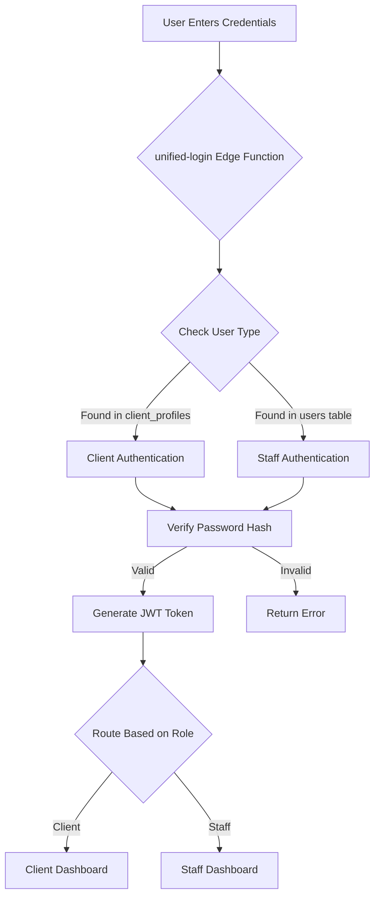
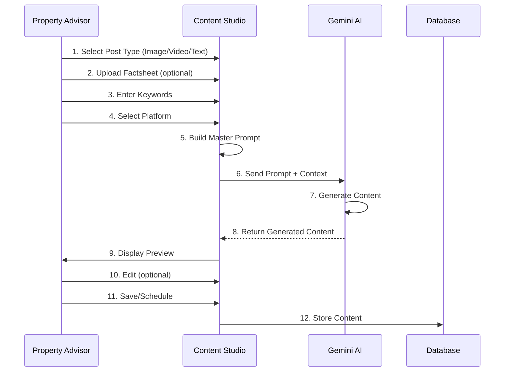
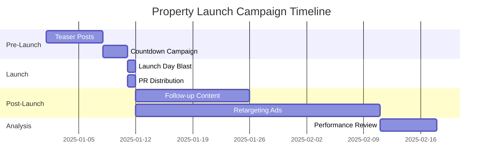
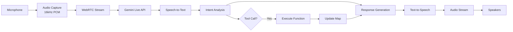

# 🚀 DarieAI - Features, EPICs & Requirements

> **Comprehensive feature documentation with user stories, acceptance criteria, and technical implementations**

---

## 📋 Table of Contents

- [EPIC 1: Unified Platform Core](#epic-1-unified-platform-core)
- [EPIC 2: AI-Powered Content Studio](#epic-2-ai-powered-content-studio)
- [EPIC 3: Client Relationship Management](#epic-3-client-relationship-management)
- [EPIC 4: Darie Map Assistant](#epic-4-Darie-map-assistant-voice-driven-3d-exploration)
- [EPIC 5: Market Intelligence System](#epic-5-market-intelligence-system)
- [EPIC 6: Contract Management](#epic-6-contract-management-system)
- [EPIC 7: Secure Vault System](#epic-7-secure-vault-system)
- [EPIC 8: Authentication & Security](#epic-8-authentication--security)

---

## EPIC 1: Unified Platform Core

**Epic Goal**: Provide a seamless integrated experience combining real estate management with AI-powered exploration

### Feature 1.1: Integrated Navigation System

**User Story**: As a user, I want to seamlessly switch between management and exploration modes

**Acceptance Criteria**:
- ✅ Single application with tab-based navigation
- ✅ Persistent state across navigation
- ✅ Role-based access to different tabs
- ✅ Smooth transitions between views
- ✅ No page reloads required

**Technical Implementation**:
```typescript
// Navigation structure
const staffNavigation = [
  { id: 'dashboard', label: 'Dashboard', icon: HomeIcon },
  { id: 'Darie-assistant', label: 'Darie Assistant', icon: MapIcon },
  { id: 'content-studio', label: 'Content Studio', icon: SparklesIcon },
  { id: 'market-intelligence', label: 'Market Intelligence', icon: ChartBarIcon },
  { id: 'clients', label: 'Clients', icon: UsersIcon },
  { id: 'contracts', label: 'Contracts', icon: DocumentIcon, roles: ['Owner', 'Admin'] },
  { id: 'master-prompts', label: 'Master Prompts', icon: CodeIcon, roles: ['Owner', 'Admin'] }
];

// State persistence with Zustand
const useNavigationStore = create((set) => ({
  currentView: 'dashboard',
  setCurrentView: (view) => set({ currentView: view }),
}));
```

**Benefits**:
- Improved user experience with instant navigation
- Reduced cognitive load
- Better workflow efficiency
- Consistent state management

---

### Feature 1.2: Unified Authentication

**User Story**: As a user, I want one login to access all platform features

**Acceptance Criteria**:
- ✅ Single sign-on for staff and clients
- ✅ Role-based dashboard routing
- ✅ Session persistence across tabs
- ✅ Secure token management
- ✅ Automatic role detection

**Authentication Flow**:


**Security Features**:
- bcrypt password hashing (10 rounds)
- JWT tokens with httpOnly cookies
- Session expiry (24h for clients, 12h for staff)
- Refresh token mechanism
- Rate limiting on login attempts

---

### Feature 1.3: Global State Management

**User Story**: As a developer, I want efficient state management across the entire platform

**Acceptance Criteria**:
- ✅ Centralized state stores
- ✅ No prop drilling required
- ✅ Real-time updates across components
- ✅ Persistent state during navigation
- ✅ Easy debugging and inspection

**Store Architecture**:
```typescript
// Map Store - For Darie Assistant
interface MapStore {
  markers: MapMarker[];
  cameraTarget: LatLngAltitudeLiteral | null;
  routes: Route[];
  preventAutoFrame: boolean;
  setMarkers: (markers: MapMarker[]) => void;
  setCameraTarget: (target: LatLngAltitudeLiteral | null) => void;
  addRoute: (route: Route) => void;
  clearRoutes: () => void;
  setPreventAutoFrame: (prevent: boolean) => void;
}

// Log Store - For conversation history
interface LogStore {
  turns: Turn[];
  logTurn: (turn: Turn) => void;
  clearLogs: () => void;
}

// Client Profile Store - For AI extraction
interface ClientProfileStore {
  profile: ClientProfile | null;
  updateProfile: (updates: Partial<ClientProfile>) => void;
  loadProfile: (userId: string) => Promise<void>;
  saveProfile: () => Promise<void>;
}

// Settings Store - For user preferences
interface SettingsStore {
  systemPrompt: string;
  model: string;
  voice: string;
  setModel: (model: string) => void;
  setVoice: (voice: string) => void;
}

// Favorites Store - For saved properties
interface FavoritesStore {
  favorites: Favorite[];
  addFavorite: (item: FavoriteItem) => void;
  removeFavorite: (id: string) => void;
  loadFavorites: (userId: string) => Promise<void>;
}
```

---

## EPIC 2: AI-Powered Content Studio

**Epic Goal**: Enable staff to generate high-quality marketing content using AI automation

### Feature 2.1: Social Media Post Generation

**User Story**: As a property advisor, I want to generate social media posts for properties

**Acceptance Criteria**:
- ✅ Generate posts for multiple platforms (Instagram, Facebook, LinkedIn)
- ✅ Customize tone, style, and length
- ✅ Include property details from factsheets
- ✅ Support image and video generation
- ✅ Preview before publishing
- ✅ Save drafts and scheduled posts

**Post Generation Flow**:


**Master Prompt Template** (Image Post):
```
You are an expert real estate marketing content designer for Darie.
Create a promotional image for a real estate campaign, optimized for digital ads or social media posts.

🎯 Objective:
Generate a visually captivating ad image that highlights either a project/development or a specific property/unit.

🧠 Input Sources:
- Factsheet: developer name, project name, handover date, payment plan, amenities, location.
- Brochure: property types, floor plans.
- Image Input: project render or unit photo (should be incorporated into the composition).

🧩 Visual Composition:
- Use a premium real estate aesthetic: elegant lighting, realistic architecture, professional layout.
- Display: Developer name, project name, 3-4 key selling points, property types, handover date, payment plan summary.
- If off-plan, include "EOI Now Open" badge.
- Always include a Call-to-Action (CTA) button: "Register Interest →", "Visit Landing Page →", or "Book Viewing →".

🏗️ Output Requirements:
- Format: Square (1:1) for social media.
- Professional, high-resolution composition.
- Clear text hierarchy and a prominent CTA.

💡 Example Concept:
"Luxury Waterfront Living – Marina Vista by Emaar. Handover Q4 2025 | 80/20 Payment Plan. Register Your EOI Now →"

Now generate the ad image composition, visually integrating all major details.
```

**Technical Implementation**:
```typescript
// services/geminiService.ts
export const generateSocialPost = async (
  masterPrompt: string,
  factsheet: string,
  keywords: string,
  platform: string
): Promise<string> => {
  const ai = new GoogleGenAI({ apiKey: GEMINI_API_KEY });

  const fullPrompt = `
    ${masterPrompt}

    ---
    CONTEXT:
    Factsheet: ${factsheet}
    User Keywords: ${keywords}
    Target Platform: ${platform}
    ---

    Generate the post copy now. Include the official company branding for Darie at the end.
  `;

  const response = await ai.models.generateContent({
    model: 'gemini-2.5-flash-latest',
    contents: fullPrompt,
  });

  return response.text;
};
```

**Supported Platforms**:
| Platform | Character Limit | Image Format | Special Features |
|----------|----------------|--------------|------------------|
| Instagram | 2,200 chars | 1:1 (1080x1080) | Hashtags, Stories, Reels |
| Facebook | 63,206 chars | 1.91:1 (1200x630) | Link previews |
| LinkedIn | 3,000 chars | 1.91:1 (1200x627) | Professional tone |
| Twitter/X | 280 chars | 16:9 (1200x675) | Thread support |

---

### Feature 2.2: Property Description Writer

**User Story**: As a property advisor, I want AI to write compelling property descriptions

**Acceptance Criteria**:
- ✅ Generate descriptions from property data
- ✅ Multiple style options (luxury, family-friendly, investment-focused)
- ✅ Include amenities and location highlights
- ✅ SEO-optimized content
- ✅ Multi-language support (English, Arabic)

**Description Styles**:

**1. Luxury Style**:
```
Discover unparalleled elegance at Marina Vista, where sophisticated design meets 
waterfront living. This exquisite 3-bedroom residence showcases floor-to-ceiling 
windows, premium Italian finishes, and breathtaking views of the Arabian Gulf. 
Experience the pinnacle of Dubai's prestigious lifestyle.
```

**2. Family-Friendly Style**:
```
Welcome to your family's perfect home in Dubai Hills Estate. This spacious 
4-bedroom villa features a large private garden, proximity to top-rated schools, 
and a secure gated community. With parks, playgrounds, and family amenities nearby, 
it's where your children can grow and thrive.
```

**3. Investment-Focused Style**:
```
Prime investment opportunity in Dubai Marina. This 2-bedroom apartment offers 
exceptional rental yields of 7-8% annually, with strong capital appreciation 
potential. Located in a high-demand area with guaranteed occupancy. Off-plan 
payment plan available: 70/30. Expected ROI: 35% over 3 years.
```

**SEO Optimization**:
- Primary keywords: "Dubai property", "Dubai Marina apartment", "luxury villa"
- Secondary keywords: "off-plan property", "investment opportunity", "beachfront"
- Location keywords: Community name, nearby landmarks
- LSI keywords: "real estate", "residential property", "freehold"

---

### Feature 2.3: Marketing Campaign Creator

**User Story**: As an admin, I want to create multi-channel marketing campaigns

**Acceptance Criteria**:
- ✅ Plan campaign across multiple properties
- ✅ Schedule content releases
- ✅ Track campaign performance
- ✅ A/B testing capabilities
- ✅ Budget management

**Campaign Structure**:
```typescript
interface Campaign {
  id: string;
  name: string;
  objective: 'awareness' | 'consideration' | 'conversion';
  properties: string[]; // Property IDs
  channels: Channel[];
  startDate: Date;
  endDate: Date;
  budget: number;
  status: 'draft' | 'active' | 'paused' | 'completed';
  metrics: CampaignMetrics;
}

interface Channel {
  platform: 'instagram' | 'facebook' | 'linkedin' | 'google-ads';
  content: ContentItem[];
  schedule: Schedule[];
  budget: number;
}

interface CampaignMetrics {
  impressions: number;
  clicks: number;
  conversions: number;
  cost: number;
  roi: number;
}
```

**Campaign Timeline**:


---

## EPIC 3: Client Relationship Management

**Epic Goal**: Provide comprehensive tools for managing client interactions and data

### Feature 3.1: Client Profile Management

**User Story**: As a property advisor, I want to maintain detailed client profiles

**Acceptance Criteria**:
- ✅ Comprehensive profile fields (budget, preferences, location)
- ✅ Interaction history tracking
- ✅ Document attachment capability
- ✅ Notes and tags system
- ✅ Activity timeline view

**Profile Data Schema**:
```typescript
interface ClientProfile {
  // Basic Information
  id: string;
  userId: string;
  firstName: string;
  lastName: string;
  email: string;
  phone: string;
  location: string;
  
  // Property Preferences
  budget: number;
  budgetCurrency: 'AED' | 'USD' | 'GBP';
  communitiesInterestedIn: string[];
  propertyType: 'Apartment' | 'Villa' | 'Townhouse' | 'Penthouse';
  maxBedrooms: number;
  maxBathrooms: number;
  
  // Investment Profile
  purpose: 'own_use' | 'investment' | 'both';
  isFirstProperty: boolean;
  downpaymentReady: boolean;
  needsMortgageAgent: boolean;
  needsGoldenVisa: boolean;
  
  // Personal Details
  age: number;
  salary: number;
  isMarried: boolean;
  childrenCount: number;
  
  // Requirements
  specificRequirements: string[];
  handoverConsideration: string;
  workLocation: string;
  projectInterestedIn: string;
  projectType: 'Off-plan' | 'Ready' | 'Both';
  
  // Metadata
  createdAt: Date;
  updatedAt: Date;
  assignedAdvisorId: string;
  status: 'Active' | 'Inactive' | 'Converted';
  source: string;
}
```

**Profile UI Layout**:
```
┌─────────────────────────────────────────┐
│ Client Profile: John Smith              │
├─────────────────────────────────────────┤
│ ┌─────────────┐  Basic Information     │
│ │   Avatar    │  Email: john@email.com │
│ │     JS      │  Phone: +971 50 123... │
│ └─────────────┘  Location: Dubai       │
├─────────────────────────────────────────┤
│ Property Preferences                    │
│ • Budget: AED 2,500,000                │
│ • Type: 3 BR Apartment                 │
│ • Areas: Dubai Marina, JBR             │
│ • Purpose: Own Use                      │
├─────────────────────────────────────────┤
│ Interaction History (Timeline)          │
│ ○ 2025-01-15: Initial consultation     │
│ ○ 2025-01-18: Property viewing         │
│ ○ 2025-01-20: Sent proposal            │
├─────────────────────────────────────────┤
│ Documents (3)                           │
│ 📄 Passport Copy                        │
│ 📄 Visa Copy                            │
│ 📄 Salary Certificate                   │
├─────────────────────────────────────────┤
│ Notes & Tags                            │
│ Tags: [Hot Lead] [Pre-Approved]        │
│                                         │
│ [Add Note] [Schedule Task] [Send Email]│
└─────────────────────────────────────────┘
```

---

### Feature 3.2: AI Profile Extraction

**User Story**: As a client, I want my preferences automatically extracted from conversations

**Acceptance Criteria**:
- ✅ Real-time extraction during voice conversations
- ✅ Extract budget, bedrooms, location, purpose
- ✅ Silent background updates
- ✅ No user prompting required
- ✅ Update existing profile data intelligently

**Extraction Mechanism**:
```typescript
// Tool definition for Gemini function calling
const updateClientProfileTool = {
  name: 'updateClientProfile',
  description: 'Extract and update client profile information from conversation',
  parameters: {
    type: 'object',
    properties: {
      projectInterestedIn: {
        type: 'string',
        description: 'Name of the project the client is interested in'
      },
      budget: {
        type: 'string',
        description: 'Client budget (e.g., "AED 2.5 million")'
      },
      communitiesInterestedIn: {
        type: 'string',
        description: 'Comma-separated list of communities'
      },
      workLocation: {
        type: 'string',
        description: 'Where the client works'
      },
      maxBedrooms: {
        type: 'string',
        description: 'Maximum number of bedrooms needed'
      },
      purpose: {
        type: 'string',
        enum: ['own use', 'investment', 'both'],
        description: 'Purpose of property purchase'
      },
      propertyType: {
        type: 'string',
        enum: ['Apartment', 'Villa', 'Townhouse', 'Penthouse'],
        description: 'Type of property preferred'
      },
      projectType: {
        type: 'string',
        enum: ['Off-plan', 'Ready'],
        description: 'Off-plan or ready property'
      }
    }
  }
};
```

**Extraction Examples**:

| User Statement | Extracted Data |
|----------------|----------------|
| "I have a budget of 3 million dirhams" | `budget: "AED 3,000,000"` |
| "Looking for a 3-bedroom apartment" | `maxBedrooms: "3", propertyType: "Apartment"` |
| "I work in DIFC" | `workLocation: "DIFC"` |
| "Interested in Dubai Hills or Arabian Ranches" | `communitiesInterestedIn: "Dubai Hills Estate, Arabian Ranches"` |
| "Want to buy for investment" | `purpose: "investment"` |
| "Prefer off-plan with payment plan" | `projectType: "Off-plan"` |
| "Need a place near schools for my 2 kids" | `childrenCount: 2, specificRequirements: ["near schools"]` |

**System Prompt for Extraction**:
```
Your absolute primary and continuous goal is to act as a "Client Profile Extractor." 
Throughout the entire conversation, from the very first user utterance to the last, 
you MUST actively listen for and extract key data points about the user.

The moment you identify any piece of information from the extraction fields, you 
MUST immediately call the updateClientProfile tool. This tool call must happen 
silently in the background. Do not mention that you are updating the profile. 
Continue the main conversation flow naturally as if nothing happened.
```

---

### Feature 3.3: Client Communication Hub

**User Story**: As a property advisor, I want centralized client communication

**Acceptance Criteria**:
- ✅ Email integration
- ✅ SMS notifications
- ✅ In-app messaging
- ✅ Communication history log
- ✅ Template messages

**Communication Channels**:

**1. Email (via Resend API)**:
```typescript
// Send property details via email
const sendPropertyEmail = async (
  clientEmail: string,
  propertyDetails: Property
) => {
  const { data, error } = await supabase.functions.invoke('send-email', {
    body: {
      to: clientEmail,
      subject: `New Property Match: ${propertyDetails.name}`,
      template: 'property-details',
      data: propertyDetails
    }
  });
};
```

**2. SMS (via Twilio API)**:
```typescript
// Send viewing confirmation SMS
const sendViewingSMS = async (
  phoneNumber: string,
  viewingDate: Date,
  propertyName: string
) => {
  const { data, error } = await supabase.functions.invoke('send-sms', {
    body: {
      to: phoneNumber,
      message: `Your property viewing for ${propertyName} is confirmed for ${viewingDate}. See you there!`
    }
  });
};
```

**3. In-App Messages**:
```typescript
// Real-time chat with Supabase Realtime
const sendInAppMessage = async (
  conversationId: string,
  message: string
) => {
  const { data, error } = await supabase
    .from('chat_messages')
    .insert({
      conversation_id: conversationId,
      role: 'advisor',
      content: message,
      created_at: new Date()
    });
};
```

**Message Templates**:
```typescript
const messageTemplates = {
  propertyMatch: {
    subject: 'New Property Match',
    body: 'Hi {firstName}, I found a property that matches your criteria...'
  },
  viewingConfirmation: {
    subject: 'Viewing Confirmation',
    body: 'Your viewing for {propertyName} is confirmed for {date} at {time}.'
  },
  followUp: {
    subject: 'Following Up',
    body: 'Hi {firstName}, just checking in about the properties we discussed...'
  },
  documentRequest: {
    subject: 'Document Request',
    body: 'To proceed, we need the following documents: {documentList}'
  }
};
```

---

## EPIC 4: Darie Map Assistant (Voice-Driven 3D Exploration)

**Epic Goal**: Provide immersive, conversational property exploration experience

### Feature 4.1: Voice-Controlled Navigation

**User Story**: As a client, I want to explore Dubai properties using voice commands

**Acceptance Criteria**:
- ✅ Natural language voice commands
- ✅ Real-time speech recognition
- ✅ Hands-free operation
- ✅ Multi-turn conversations
- ✅ Context awareness

**Voice Architecture**:


**Supported Voice Commands**:

| Command Type | Examples | Action |
|-------------|----------|---------|
| Navigation | "Take me to Dubai Marina" | Fly to location |
| | "Show me Palm Jumeirah" | Frame area |
| | "Navigate to Downtown Dubai" | Camera animation |
| Search | "Find villas in Arabian Ranches" | Filter + display |
| | "Show off-plan apartments under 2M" | Query database |
| | "Properties near Dubai Mall" | Proximity search |
| Amenities | "Where are the nearest schools?" | POI search |
| | "Show hospitals within 5km" | Radius search |
| | "Find restaurants around here" | Place search |
| Information | "Tell me about Emaar Properties" | Knowledge query |
| | "What's the average price in Marina?" | Market data |
| | "Explain Golden Visa requirements" | Advisory |

**Voice Settings**:
```typescript
// Available voices (Gemini 2.5 Flash)
const AVAILABLE_VOICES = [
  'Puck',      // Friendly, casual
  'Charon',    // Professional, authoritative
  'Kore',      // Warm, empathetic
  'Fenrir',    // Energetic, enthusiastic
  'Aoede',     // Calm, soothing
  'Zephyr'     // Default - balanced
];

// Voice configuration
const voiceConfig = {
  model: 'gemini-2.5-flash-native-audio-preview',
  voice: 'Zephyr',
  responseModalities: 'audio',
  speechConfig: {
    voiceConfig: {
      prebuiltVoiceConfig: {
        voiceName: 'Zephyr'
      }
    }
  }
};
```

---

### Feature 4.2: 3D Map Visualization

**User Story**: As a user, I want to see properties in photorealistic 3D

**Acceptance Criteria**:
- ✅ Photorealistic 3D rendering
- ✅ Smooth camera transitions
- ✅ Dynamic marker placement
- ✅ Interactive property markers
- ✅ Zoom and pan controls

**Map Configuration**:
```typescript
// Initial view props for Dubai
const INITIAL_VIEW_PROPS = {
  center: {
    lat: 25.12,  // Dubai city center
    lng: 55.22,
    altitude: 1000
  },
  range: 35000,  // Camera distance
  heading: 0,    // North-facing
  tilt: 30,      // Camera angle
  roll: 0        // No rotation
};

// Map component
<Map3D
  ref={mapRef}
  {...viewProps}
  onCameraChange={handleCameraChange}
>
  {/* Markers are children */}
  {markers.map(marker => (
    <Marker3D
      key={marker.id}
      position={marker.position}
      onClick={() => handleMarkerClick(marker)}
    />
  ))}
</Map3D>
```

**Camera Animations**:
```typescript
// Smooth camera transition
const flyTo = (target: LatLngAltitudeLiteral, duration: number = 2000) => {
  const start = performance.now();
  const startPos = currentCameraPosition;
  const endPos = target;
  
  const animate = (time: number) => {
    const elapsed = time - start;
    const progress = Math.min(elapsed / duration, 1);
    
    // Easing function for smooth motion
    const eased = 1 - Math.pow(1 - progress, 3);
    
    const interpolated = {
      lat: startPos.lat + (endPos.lat - startPos.lat) * eased,
      lng: startPos.lng + (endPos.lng - startPos.lng) * eased,
      altitude: startPos.altitude + (endPos.altitude - startPos.altitude) * eased
    };
    
    setCameraPosition(interpolated);
    
    if (progress < 1) {
      requestAnimationFrame(animate);
    }
  };
  
  requestAnimationFrame(animate);
};
```

**Marker Types**:
```typescript
enum MarkerType {
  PROPERTY = 'property',      // Property listings
  AMENITY = 'amenity',        // Schools, hospitals, etc.
  LANDMARK = 'landmark',      // Points of interest
  COMMUNITY = 'community'     // Community centers
}

interface MapMarker {
  id: string;
  type: MarkerType;
  position: { lat: number; lng: number; altitude?: number };
  title: string;
  description?: string;
  icon: string;
  metadata?: any;
}
```

---

### Feature 4.3: Community Location Tool

**User Story**: As a user, I want to quickly navigate to Dubai communities

**Acceptance Criteria**:
- ✅ Voice command: "Take me to [community]"
- ✅ Animated camera flight
- ✅ Automatic framing of area
- ✅ Display community information
- ✅ Support 50+ Dubai communities

**Tool Implementation**:
```typescript
// Function declaration for Gemini
const locateCommunityTool = {
  name: 'locateCommunity',
  description: 'Navigate the 3D map camera to fly to and frame a specified Dubai community or location. Use this when the user asks to see, visit, or explore a specific area.',
  parameters: {
    type: 'object',
    properties: {
      community_name: {
        type: 'string',
        description: 'The name of the Dubai community or area to locate (e.g., "Dubai Marina", "Palm Jumeirah", "Dubai Hills Estate")'
      },
      user_id: {
        type: 'string',
        description: 'Optional user ID for tracking preferences'
      }
    },
    required: ['community_name']
  }
};

// Tool execution function
async function locateCommunity(args: { community_name: string; user_id?: string }) {
  const { community_name, user_id } = args;
  
  // Normalize community name
  const normalizedName = community_name.toLowerCase().trim();
  
  // Look up coordinates in database
  const coordinates = dubaiCommunities[normalizedName];
  
  if (!coordinates) {
    return {
      success: false,
      message: `Community "${community_name}" not found. Please try another location.`
    };
  }
  
  // Update map camera
  useMapStore.getState().setCameraTarget({
    lat: coordinates.lat,
    lng: coordinates.lng,
    altitude: 500
  });
  
  // Save to user favorites (optional)
  if (user_id) {
    await saveFavoriteLocation(user_id, community_name, coordinates);
  }
  
  return {
    success: true,
    latitude: coordinates.lat,
    longitude: coordinates.lng,
    camera_updated: true,
    message: `Flying to ${community_name}`
  };
}
```

**Supported Communities** (50+):
```typescript
const dubaiCommunities: Record<string, { lat: number; lng: number }> = {
  'dubai marina': { lat: 25.0784, lng: 55.1384 },
  'palm jumeirah': { lat: 25.1189, lng: 55.1383 },
  'downtown dubai': { lat: 25.1972, lng: 55.2744 },
  'dubai hills estate': { lat: 25.1118, lng: 55.2575 },
  'business bay': { lat: 25.1834, lng: 55.2709 },
  'jumeirah beach residence': { lat: 25.0770, lng: 55.1330 },
  'arabian ranches': { lat: 25.0493, lng: 55.2818 },
  'dubai creek harbour': { lat: 25.2069, lng: 55.3394 },
  'sobha hartland ii': { lat: 25.1763, lng: 55.3117 },
  'damac lagoons': { lat: 25.0435, lng: 55.2443 },
  // ... 40+ more communities
};
```

---

### Feature 4.4: Project Discovery Tool

**User Story**: As a user, I want to find properties matching my criteria

**Acceptance Criteria**:
- ✅ Filter by price, type, developer
- ✅ Display property markers on map
- ✅ Show property details on click
- ✅ Save favorite properties
- ✅ Compare multiple properties

**Tool Implementation**:
```typescript
const findProjectsTool = {
  name: 'findProjects',
  description: 'Search for real estate projects and display them on the 3D map',
  parameters: {
    type: 'object',
    properties: {
      community: {
        type: 'string',
        description: 'Community name to search within'
      },
      property_type: {
        type: 'string',
        enum: ['Villa', 'Apartment', 'Townhouse', 'Penthouse'],
        description: 'Type of property'
      },
      project_type: {
        type: 'string',
        enum: ['Off-plan', 'Ready'],
        description: 'Off-plan or ready property'
      },
      max_price: {
        type: 'number',
        description: 'Maximum price in AED'
      },
      min_bedrooms: {
        type: 'number',
        description: 'Minimum number of bedrooms'
      }
    }
  }
};

async function findProjects(filters: ProjectFilters) {
  // Query database
  let projects = realEstateProjects[filters.community] || [];
  
  // Apply filters
  if (filters.property_type) {
    projects = projects.filter(p => p.type === filters.property_type);
  }
  
  if (filters.project_type) {
    projects = projects.filter(p => p.project_type === filters.project_type);
  }
  
  if (filters.max_price) {
    projects = projects.filter(p => p.starting_price <= filters.max_price);
  }
  
  if (filters.min_bedrooms) {
    projects = projects.filter(p => 
      p.project_specs?.unit_types.some(u => 
        parseInt(u.unit_type) >= filters.min_bedrooms
      )
    );
  }
  
  // Create markers
  const markers = projects.map(project => ({
    id: project.name,
    type: 'property' as const,
    position: project.position,
    title: project.name,
    metadata: project
  }));
  
  // Update map
  useMapStore.getState().setMarkers(markers);
  
  return {
    success: true,
    projects: projects,
    total_count: projects.length
  };
}
```

**Project Data Structure**:
```typescript
interface Project {
  name: string;
  type: 'Apartment' | 'Villa' | 'Townhouse';
  position: { lat: number; lng: number };
  amenities: string[];
  location_description: string;
  launch_date: string;
  handover_date_normalized: string;
  project_type: 'Off-plan' | 'Ready' | 'For Rent';
  starting_price: number;
  currency_code: 'AED' | 'USD';
  service_charge: number;
  is_freehold: boolean;
  project_image_url: string;
  project_specs?: {
    avg_price_per_sqft: number;
    unit_types: {
      unit_type: string;  // "1 BR", "2 BR", etc.
      avg_size_sqft: number;
    }[];
  };
}
```

---

### Feature 4.5: Maps Grounding Tool

**User Story**: As a user, I want to find amenities near properties

**Acceptance Criteria**:
- ✅ Search for schools, hospitals, malls, restaurants
- ✅ Display results on map
- ✅ Show distance from property
- ✅ Get detailed place information
- ✅ Filter by rating and type

**Tool Implementation**:
```typescript
const mapsGroundingTool = {
  name: 'mapsGrounding',
  description: 'Search for places, amenities, or points of interest near a location using Google Maps. Use this to find schools, hospitals, restaurants, malls, parks, etc.',
  parameters: {
    type: 'object',
    properties: {
      query: {
        type: 'string',
        description: 'Search query (e.g., "schools near Dubai Marina", "restaurants", "hospitals within 5km")'
      },
      location_bias: {
        type: 'object',
        description: 'Optional location to bias search results',
        properties: {
          center: {
            type: 'object',
            properties: {
              lat: { type: 'number' },
              lng: { type: 'number' }
            }
          },
          radius: {
            type: 'number',
            description: 'Search radius in meters'
          }
        }
      }
    },
    required: ['query']
  }
};

async function mapsGrounding(args: {
  query: string;
  location_bias?: { center: LatLng; radius: number };
}) {
  // Call Google Maps Grounding API via Gemini
  const response = await fetch(
    'https://generativelanguage.googleapis.com/v1beta/models/gemini-2.5-flash-latest:generateContent',
    {
      method: 'POST',
      headers: {
        'Content-Type': 'application/json',
        'x-goog-api-key': GEMINI_API_KEY
      },
      body: JSON.stringify({
        contents: [{ parts: [{ text: args.query }] }],
        tools: [{
          googleSearchRetrieval: {
            dynamicRetrievalConfig: {
              mode: 'MODE_DYNAMIC',
              dynamicThreshold: 0.3
            }
          }
        }]
      })
    }
  );
  
  const data = await response.json();
  
  // Extract place IDs from grounding chunks
  const groundingChunks = data.candidates[0].groundingMetadata?.groundingChunks || [];
  const placeIds = groundingChunks
    .filter(chunk => chunk.web?.uri?.includes('maps.google.com'))
    .map(chunk => extractPlaceId(chunk.web.uri));
  
  // Fetch place details for each ID
  const places = await Promise.all(
    placeIds.map(id => fetchPlaceDetails(id))
  );
  
  // Create markers
  const markers = places.map(place => ({
    id: place.id,
    type: 'amenity' as const,
    position: place.location,
    title: place.displayName,
    metadata: place
  }));
  
  // Update map
  useMapStore.getState().setMarkers(markers);
  
  return {
    success: true,
    places: places,
    grounding_chunk: groundingChunks[0]
  };
}
```

**Place Details Structure**:
```typescript
interface Place {
  id: string;
  displayName: string;
  formattedAddress: string;
  location: { lat: number; lng: number };
  types: string[];
  rating?: number;
  userRatingCount?: number;
  websiteUri?: string;
  phoneNumber?: string;
  openingHours?: {
    weekdayDescriptions: string[];
  };
}
```

---

Part 2: Features, EPICs & Requirements. Would you like me to continue with Part 3 (Use Cases & User Stories) or Part 4 (Installation & Configuration)?

