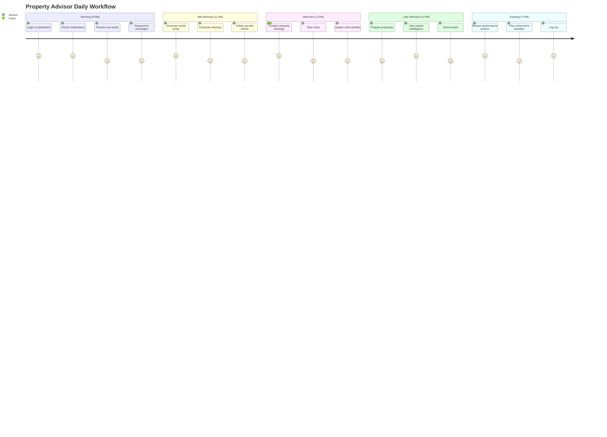

# 📖 DarieAI - Use Cases & User Stories

> **Comprehensive use case documentation with user flows, scenarios, and interaction patterns**

---

## 📋 Table of Contents

- [Primary User Roles](#primary-user-roles)
- [Staff Use Cases](#staff-use-cases)
- [Client Use Cases](#client-use-cases)
- [Map Assistant Use Cases](#map-assistant-use-cases)
- [User Journey Maps](#user-journey-maps)
- [Interaction Scenarios](#interaction-scenarios)

---

## 👥 Primary User Roles

### 1. Owner
**Description**: Business owner with full system access
**Capabilities**:
- All admin capabilities
- Financial reporting and analytics
- System configuration
- Staff management
- Strategic decision-making

**Goals**:
- Monitor business performance
- Optimize operations
- Scale the business
- Ensure compliance

---

### 2. Admin
**Description**: System administrator managing operations
**Capabilities**:
- Create and manage staff accounts
- Access all client data
- Manage contracts
- Configure master prompts
- View all reports

**Goals**:
- Efficient team management
- Data integrity
- Process optimization
- Quality control

---

### 3. Property Advisor
**Description**: Front-line staff managing client relationships
**Capabilities**:
- Manage assigned clients
- Generate marketing content
- Create property listings
- Track interactions
- Use map assistant

**Goals**:
- Close more deals
- Provide excellent service
- Build client relationships
- Meet sales targets

---

### 4. Client
**Description**: Property seeker or investor
**Capabilities**:
- Explore properties via map assistant
- Save favorite properties
- Upload documents to vault
- Communicate with advisor
- View personalized recommendations

**Goals**:
- Find ideal property
- Make informed decisions
- Understand market
- Simplify buying process

---

## 💼 Staff Use Cases

### Use Case 1: Onboard New Client

**Actor**: Property Advisor

**Preconditions**: Advisor is logged in to staff dashboard

**Main Flow**:
1. Advisor clicks "Add New Client" in Clients section
2. System displays client registration form
3. Advisor enters client details:
   - First Name: Ahmed
   - Last Name: Al-Mansouri
   - Email: ahmed@example.com
   - Phone: +971 50 123 4567
   - Location: Dubai
4. Advisor assigns self as primary advisor
5. System creates client account
6. System sends welcome email with login credentials
7. Advisor adds initial notes: "Interested in Dubai Marina apartments"
8. System saves client profile

**Postconditions**: 
- Client account created
- Welcome email sent
- Client appears in advisor's client list
- Initial interaction logged

**Alternative Flows**:
- 3a. Email already exists → System shows error, advisor updates email
- 6a. Email delivery fails → System logs error, advisor contacts client manually

**Business Rules**:
- Email must be unique in system
- Phone number must be valid Dubai format (+971...)
- Client automatically assigned "Active" status

---

### Use Case 2: Generate Social Media Post

**Actor**: Property Advisor

**Preconditions**: 
- Advisor is logged in
- Property listing exists in system

**Main Flow**:
1. Advisor navigates to Content Studio
2. Advisor clicks "Generate New Post"
3. System displays generation options
4. Advisor selects:
   - Type: Image Post
   - Platform: Instagram
   - Property: Marina Vista Apartments
5. Advisor uploads property factsheet (PDF)
6. Advisor enters keywords: "luxury, waterfront, investment"
7. Advisor clicks "Generate"
8. System calls Gemini AI with master prompt + context
9. AI generates post content and image suggestions
10. System displays preview
11. Advisor reviews and makes minor edits
12. Advisor clicks "Save as Draft"
13. System saves content to database

**Postconditions**:
- Post content generated
- Saved in drafts folder
- Available for scheduling or publishing
- Logged in activity feed

**Alternative Flows**:
- 8a. AI generation fails → System shows error, suggests retry
- 11a. Advisor not satisfied → Clicks "Regenerate" with different tone

**Success Criteria**:
- Post generated in < 30 seconds
- Content is relevant and professional
- Images suggestions are appropriate
- Edit capabilities work smoothly

---

### Use Case 3: Schedule Property Viewing

**Actor**: Property Advisor

**Preconditions**: 
- Client has expressed interest in property
- Property is available for viewing

**Main Flow**:
1. Advisor opens client profile
2. Advisor clicks "Schedule Viewing"
3. System displays calendar and property list
4. Advisor selects:
   - Property: Palm Residences, Unit 402
   - Date: 2025-01-25
   - Time: 14:00
   - Duration: 1 hour
5. System checks availability
6. Advisor adds notes: "Client wants to see sea view"
7. Advisor clicks "Confirm Viewing"
8. System creates calendar event
9. System sends confirmation email to client
10. System sends SMS reminder to client (24h before)
11. System adds task to advisor's calendar

**Postconditions**:
- Viewing scheduled
- Client notified via email + SMS
- Calendar event created for advisor
- Interaction logged in client history

**Alternative Flows**:
- 5a. Time slot not available → System suggests alternative times
- 9a. Email fails → System logs error, advisor contacts manually

**Business Rules**:
- Viewings must be between 9 AM - 8 PM
- Minimum 2 hours advance notice required
- Maximum 5 viewings per day per advisor

---

### Use Case 4: Create Property Contract

**Actor**: Admin

**Preconditions**: 
- Client has agreed to terms
- Property is available
- All documents verified

**Main Flow**:
1. Admin navigates to Contracts section
2. Admin clicks "Create New Contract"
3. System displays contract form
4. Admin fills in details:
   - Client: Ahmed Al-Mansouri
   - Property: Marina Vista, Unit 1205
   - Contract Type: Sale
   - Price: AED 2,500,000
   - Payment Terms: 70/30
   - Start Date: 2025-02-01
   - Completion Date: 2025-12-31
5. Admin uploads supporting documents
6. System validates all fields
7. Admin reviews generated contract PDF
8. Admin clicks "Submit for Signature"
9. System sends contract to client via email
10. System sets status to "Pending Signature"

**Postconditions**:
- Contract created in system
- PDF generated
- Client notified
- Contract appears in pending list
- Commission calculated automatically

**Alternative Flows**:
- 6a. Required field missing → System highlights field, admin completes
- 9a. Client wants changes → Admin edits contract, resends

**Business Rules**:
- Only Owner/Admin can create contracts
- All mandatory fields must be completed
- Contract number auto-generated
- Digital signature required for execution

---

### Use Case 5: Generate Market Report

**Actor**: Property Advisor

**Preconditions**: 
- Market data is available
- Advisor has permission to access reports

**Main Flow**:
1. Advisor navigates to Market Intelligence
2. Advisor clicks "Generate Report"
3. System displays report options
4. Advisor selects:
   - Report Type: Area Analysis
   - Area: Dubai Marina
   - Period: Last 6 months
   - Include: Price trends, rental yields, supply/demand
5. Advisor clicks "Generate"
6. System queries database for market data
7. System calls Gemini AI for analysis
8. AI generates comprehensive report with insights
9. System creates visualizations (charts, graphs)
10. System displays report preview
11. Advisor clicks "Download PDF"
12. System generates PDF and initiates download

**Postconditions**:
- Report generated successfully
- PDF available for download
- Report saved to advisor's reports library
- Can be shared with clients

**Alternative Flows**:
- 6a. Insufficient data → System shows warning, suggests broader criteria
- 8a. AI analysis takes too long → System shows progress indicator

**Success Criteria**:
- Report generated in < 2 minutes
- Data is accurate and up-to-date
- Visualizations are clear and professional
- Insights are actionable

---

## 🏠 Client Use Cases

### Use Case 6: Sign Up as New Client

**Actor**: Potential Client

**Preconditions**: 
- User has valid email and phone number
- User is not already registered

**Main Flow**:
1. User visits DarieAI landing page
2. User clicks "Client Sign Up"
3. System displays registration form
4. User enters:
   - Email: sara@example.com
   - Phone: +971 55 987 6543
   - First Name: Sara
   - Last Name: Ahmed
   - Location: Dubai
   - Password: SecurePass123!
5. User clicks "Sign Up"
6. System validates input
7. System generates 6-digit OTP codes
8. System sends OTP via email (123456)
9. System sends OTP via SMS (123456)
10. System displays OTP verification screen
11. User enters OTP: 123456
12. System verifies OTP
13. System creates user account
14. System creates client profile
15. System auto-logs in user
16. System displays client dashboard

**Postconditions**:
- Client account created
- Email and phone verified
- User logged in
- Welcome tour displayed (optional)

**Alternative Flows**:
- 6a. Email already exists → System shows error
- 6b. Password too weak → System shows requirements
- 12a. OTP incorrect → User has 4 more attempts
- 12b. OTP expired (>10 mins) → System prompts resend

**Business Rules**:
- Email must be unique
- Password minimum 8 characters, 1 uppercase, 1 number
- OTP expires in 10 minutes
- Maximum 5 OTP verification attempts
- After 5 failed attempts, wait 1 hour

---

### Use Case 7: Explore Properties via Voice

**Actor**: Client

**Preconditions**: 
- Client is logged in
- Microphone permission granted

**Main Flow**:
1. Client clicks "Darie Assistant" tab
2. System loads 3D map (Dubai overview)
3. System connects to Gemini Live API
4. System displays "Ready to assist" message
5. Client clicks microphone button
6. Client speaks: "Show me 3-bedroom apartments in Dubai Marina under 2.5 million dirhams"
7. System captures audio (16kHz PCM)
8. System streams audio to Gemini Live
9. Gemini transcribes speech in real-time
10. System displays transcription: "Show me 3-bedroom apartments..."
11. Gemini analyzes intent → calls findProjects tool
12. System queries database with filters:
    - Community: Dubai Marina
    - Property Type: Apartment
    - Bedrooms: 3
    - Max Price: 2,500,000 AED
13. System finds 12 matching properties
14. System places markers on map
15. System animates camera to Dubai Marina
16. Gemini generates voice response
17. System plays audio: "I found 12 three-bedroom apartments in Dubai Marina within your budget..."
18. System displays transcription
19. Client sees markers on map

**Postconditions**:
- Properties displayed on map
- Client can click markers for details
- Conversation logged
- Client preferences extracted (budget, bedrooms, location)

**Alternative Flows**:
- 6a. Microphone fails → Client uses text input instead
- 12a. No properties found → System suggests alternatives
- 16a. Audio playback issues → Client reads transcription

**Success Criteria**:
- Voice recognized accurately (>90%)
- Response time < 3 seconds
- Map updates smoothly
- Audio quality clear

---

### Use Case 8: Save Favorite Property

**Actor**: Client

**Preconditions**: 
- Client viewing property details on map
- Property marker is active

**Main Flow**:
1. Client clicks on property marker
2. System displays property popup with:
   - Property name
   - Price
   - Bedrooms/Bathrooms
   - Developer
   - View Details button
   - Heart icon (unfilled)
3. Client clicks heart icon
4. System animates heart (fill animation)
5. System saves to favorites store
6. System updates Supabase database
7. System shows toast notification: "Added to favorites"
8. Heart icon now filled (solid)

**Postconditions**:
- Property saved to favorites
- Accessible from "Saved Properties" section
- Synced across devices
- Can be shared with advisor

**Alternative Flows**:
- 4a. Property already in favorites → System removes (toggle)
- 6a. Database save fails → System retries, shows error if persistent

**Business Rules**:
- Maximum 50 saved properties per user
- Favorites synced in real-time
- Can add notes to saved properties

---

### Use Case 9: Upload Document to Vault

**Actor**: Client

**Preconditions**: 
- Client is logged in
- Has document to upload (PDF, image, etc.)

**Main Flow**:
1. Client navigates to "My Vault" section
2. System displays current documents
3. Client clicks "Upload Document"
4. System opens file picker dialog
5. Client selects file: Passport_Copy.pdf (2.5 MB)
6. Client selects category: "Passport"
7. Client adds optional note: "Passport valid until 2030"
8. Client clicks "Upload"
9. System validates file (type, size)
10. System uploads to Supabase Storage
11. System shows progress bar
12. System encrypts file at rest
13. System creates database record
14. System shows success message
15. Document appears in vault list

**Postconditions**:
- Document uploaded and encrypted
- Metadata saved in database
- Accessible for download
- Can be shared with advisor

**Alternative Flows**:
- 9a. File too large (>10MB) → System shows error
- 9b. Invalid file type → System shows allowed types
- 10a. Upload fails → System retries 3 times

**Business Rules**:
- Maximum file size: 10 MB
- Allowed types: PDF, JPG, PNG, DOC, DOCX
- Files encrypted with AES-256
- Client can only access own files (RLS)
- Retention: Indefinite until client deletes

---

### Use Case 10: Request Property Viewing

**Actor**: Client

**Preconditions**: 
- Client has found interesting property
- Property is available for viewing

**Main Flow**:
1. Client viewing property details
2. Client clicks "Request Viewing"
3. System displays viewing request form
4. Client selects preferred dates (3 options):
   - Option 1: 2025-01-22, 10:00 AM
   - Option 2: 2025-01-23, 2:00 PM
   - Option 3: 2025-01-24, 4:00 PM
5. Client adds message: "Interested in seeing the balcony and parking"
6. Client clicks "Submit Request"
7. System creates viewing request
8. System notifies assigned advisor via email + in-app
9. System sends confirmation to client: "Request received"
10. System sets status: "Pending Confirmation"

**Postconditions**:
- Viewing request created
- Advisor notified
- Client can track status
- Reminder set for follow-up

**Alternative Flows**:
- 8a. No advisor assigned → System notifies admin
- 10a. Advisor responds quickly → Status changes to "Confirmed"

**Business Rules**:
- Must select at least 1 preferred time
- Minimum 24 hours advance notice
- Maximum 3 pending requests per client

---

## 🗺️ Map Assistant Use Cases

### Use Case 11: Navigate to Community

**Actor**: Client or Staff

**Preconditions**: 
- User is in Darie Map Assistant
- Map is loaded

**Main Flow**:
1. User speaks or types: "Take me to Palm Jumeirah"
2. System transcribes input
3. Gemini analyzes intent → community navigation
4. Gemini calls locateCommunity tool with args:
   ```json
   {
     "community_name": "Palm Jumeirah",
     "user_id": "user123"
   }
   ```
5. Tool function executes:
   - Looks up coordinates: { lat: 25.1189, lng: 55.1383 }
   - Updates map state
6. Map controller receives camera target
7. Camera animates from current position to target
8. Animation duration: 2 seconds (smooth interpolation)
9. Camera tilts to optimal viewing angle
10. Gemini responds: "Flying to Palm Jumeirah. This iconic man-made island features luxury villas and apartments with private beaches..."
11. System plays voice response
12. Map arrives at destination

**Postconditions**:
- Camera positioned at Palm Jumeirah
- Area framed in view
- User can explore further
- Location saved to recent searches

**Alternative Flows**:
- 4a. Community not recognized → Gemini asks for clarification
- 4b. Multiple matches → Gemini asks which one

**Technical Details**:
```typescript
// Camera animation
flyTo({
  lat: 25.1189,
  lng: 55.1383,
  altitude: 500
}, {
  duration: 2000,
  easing: 'easeInOutCubic'
});
```

---

### Use Case 12: Find Nearby Amenities

**Actor**: Client

**Preconditions**: 
- User is viewing a property location on map

**Main Flow**:
1. User asks: "What schools are near this property?"
2. Gemini analyzes intent → amenity search
3. Gemini calls mapsGrounding tool:
   ```json
   {
     "query": "schools near Dubai Marina",
     "location_bias": {
       "center": { "lat": 25.0784, "lng": 55.1384 },
       "radius": 5000
     }
   }
   ```
4. Tool calls Google Maps Grounding API
5. API returns place IDs: ["ChIJ1234...", "ChIJ5678..."]
6. Tool fetches details for each place:
   - Dubai International Academy
   - GEMS World Academy
   - Nord Anglia International School
7. Tool creates markers with school data
8. System places markers on map
9. Gemini generates response: "I found 3 schools within 5km. The closest is Dubai International Academy, 1.2km away, rated 4.5 stars..."
10. System displays school markers (blue icons)
11. User can click each marker for details

**Postconditions**:
- School markers visible on map
- Each marker clickable
- Distance information displayed
- Results logged in conversation

**Alternative Flows**:
- 5a. No schools found → System expands search radius
- 6a. Place details unavailable → System uses basic info only

**Place Information Displayed**:
- Name
- Distance from property
- Rating (stars)
- Address
- Phone number
- Opening hours
- Website link

---

### Use Case 13: Extract Client Budget

**Actor**: Client (speaking) + System (listening)

**Preconditions**: 
- Client is in conversation with map assistant
- Client profile exists in database

**Main Flow**:
1. Client says: "I'm looking for an apartment, my budget is around 3 million dirhams"
2. Gemini processes audio and transcribes
3. Gemini identifies profile data:
   - Property Type: Apartment
   - Budget: AED 3,000,000
4. Gemini calls updateClientProfile tool (silently):
   ```json
   {
     "property_type": "Apartment",
     "budget": "AED 3,000,000"
   }
   ```
5. Tool function executes:
   - Updates ClientProfileStore in Zustand
   - Calls Supabase to update database:
     ```sql
     UPDATE client_profiles 
     SET property_type = 'Apartment',
         budget = 3000000,
         updated_at = NOW()
     WHERE user_id = 'user123'
     ```
6. Database update succeeds
7. Tool returns success to Gemini
8. Gemini continues conversation naturally: "Great! I can show you apartments within your 3 million dirham budget. Which areas are you interested in?"
9. **User is unaware profile was updated** (silent background operation)

**Postconditions**:
- Client profile updated with budget and property type
- Data available for future recommendations
- Advisor can see updated preferences
- No interruption to conversation flow

**Alternative Flows**:
- 6a. Database update fails → Tool retries, logs error if persistent
- 3a. Multiple data points in one sentence → Extracts all simultaneously

**Extraction Fields Supported**:
- Budget
- Property Type (Apartment, Villa, Townhouse)
- Number of bedrooms
- Location preferences
- Purpose (investment vs own use)
- Timeline
- Family size
- Work location
- Specific requirements

---

### Use Case 14: Multi-Turn Conversation Context

**Actor**: Client

**Preconditions**: 
- Client has already had conversation with assistant

**Conversation Flow**:

**Turn 1**:
```
Client: "Show me properties in Dubai Marina"
Assistant: [Displays properties] "I found 24 properties in Dubai Marina. 
           They range from studios to 4-bedroom apartments. 
           What's your budget?"
```

**Turn 2**:
```
Client: "Around 2 million"
Assistant: [Filters results] "I've narrowed it down to 8 properties under 
           AED 2 million. Most are 1 and 2 bedroom apartments. 
           Are you looking for yourself or investment?"
```

**Turn 3**:
```
Client: "For myself, need 2 bedrooms"
Assistant: [Further filters] "Perfect! I have 3 excellent 2-bedroom options 
           for you in Dubai Marina. The best value is Marina Heights at 
           AED 1.85 million. Would you like to see it on the map?"
```

**Turn 4**:
```
Client: "Yes, show me"
Assistant: [Highlights property] "Here's Marina Heights. It's right on the 
           waterfront with stunning views. It also has a gym, pool, and 
           24/7 security. Would you like to know about nearby amenities?"
```

**Turn 5**:
```
Client: "What's close by?"
Assistant: [Shows amenities] "Great question! Within walking distance you have:
           - Dubai Marina Mall (300m)
           - Metro station (400m)
           - 3 supermarkets
           - 12 restaurants
           Would you like to schedule a viewing?"
```

**Key Features**:
- Context maintained across all turns
- No need to repeat information
- Natural conversation flow
- Each response builds on previous
- Profile data extracted continuously

**Technical Implementation**:
```typescript
// Conversation history maintained
const conversationHistory = [
  { role: 'user', content: 'Show me properties in Dubai Marina' },
  { role: 'assistant', content: 'I found 24 properties...' },
  { role: 'user', content: 'Around 2 million' },
  { role: 'assistant', content: 'I\'ve narrowed it down...' },
  // ... all previous messages included in each API call
];
```

---

## 🗺️ User Journey Maps

### Journey 1: New Client - From Sign-Up to Property Viewing

```mermaid
journey
    title New Client Journey: First Week
    section Day 1: Discovery
      Visit website: 3: Client
      Sign up with OTP: 4: Client
      Complete profile: 4: Client
      Open Map Assistant: 5: Client
    section Day 2: Exploration
      Voice search properties: 5: Client
      Save 3 favorites: 4: Client
      Request viewing: 5: Client
    section Day 3: Engagement
      Receive viewing confirmation: 5: Client, Advisor
      Upload documents to vault: 4: Client
      Chat with advisor: 5: Client, Advisor
    section Day 5: Viewing
      Attend property viewing: 5: Client, Advisor
      Discuss financing options: 4: Client, Advisor
      Express interest: 5: Client
    section Day 7: Decision
      Review proposal: 4: Client
      Sign intent form: 5: Client
      Become active lead: 5: Client, Advisor
```

---

### Journey 2: Property Advisor - Daily Workflow



---

## 🎭 Interaction Scenarios

### Scenario 1: First-Time Property Buyer

**Background**: 
- Name: Priya Sharma
- Age: 32
- Occupation: Software Engineer
- Status: First-time buyer
- Budget: AED 1.8 - 2.2 million
- Needs: 2 BR apartment, near metro

**Interaction Timeline**:

**Week 1: Research Phase**
```
Day 1:
- Signs up as client
- Explores Dubai Marina via map assistant
- Asks about: "What's the average price for 2-bedroom apartments?"
- System extracts: budget range, property type
- Saves 5 properties to favorites

Day 3:
- Returns to platform
- Asks: "What are my financing options as a first-time buyer?"
- AI provides information on mortgages, down payment
- Uploads salary certificate to vault

Day 5:
- Refines search: "Show me properties near metro stations"
- Maps assistant highlights metro-accessible areas
- Finds 3 suitable options
```

**Week 2: Viewing Phase**
```
Day 8:
- Requests viewing for 2 properties
- Advisor confirms slots
- Receives confirmation email + SMS

Day 10:
- Attends first viewing with advisor
- Asks about: community amenities, service charges
- Advisor uses map assistant to show nearby facilities

Day 12:
- Attends second viewing
- Narrowing down decision
```

**Week 3: Decision Phase**
```
Day 15:
- Decides on property
- Receives proposal from advisor
- Reviews payment plan options

Day 18:
- Signs Expression of Interest (EOI)
- Pays booking fee
- Becomes active client
```

---

### Scenario 2: Investor Looking for Multiple Properties

**Background**:
- Name: Mohammed Al-Farsi
- Age: 45
- Occupation: Business Owner
- Status: Experienced investor
- Budget: AED 10-15 million (portfolio)
- Needs: 3-4 properties for rental income

**Interaction Timeline**:

**Week 1: Market Analysis**
```
- Uses market intelligence tools
- Generates reports for multiple areas
- Analyzes rental yields by community
- Compares off-plan vs ready properties
```

**Week 2: Property Identification**
```
- Uses map assistant to explore high-yield areas
- Filters by: ROI, rental yield, capital appreciation potential
- Saves 15 properties to favorites
- Tags them: "High Yield", "Good Location", "Off-Plan Discount"
```

**Week 3: Due Diligence**
```
- Requests detailed information on top 6 properties
- Advisor provides developer track record
- Reviews payment plans and handover dates
- Calculates total investment and expected returns
```

**Week 4-5: Acquisition**
```
- Schedules bulk viewings (3 properties/day)
- Negotiates prices with advisor's help
- Decides on 4 properties across different communities
- Signs multiple contracts
- Advisor manages entire process
```

---

### Scenario 3: Family Relocating to Dubai

**Background**:
- Name: David & Emma Wilson
- Ages: 38 & 36
- Occupation: Both working professionals
- Status: Relocating from London
- Children: 2 (ages 6 and 9)
- Budget: AED 3.5 million
- Needs: 3-4 BR villa, near schools

**Interaction Timeline**:

**Month 1: Remote Research (From London)**
```
Week 1:
- Emma signs up on platform
- Uses map assistant to explore Dubai communities
- Asks: "Which areas are best for families with children?"
- AI recommends: Arabian Ranches, Dubai Hills, Jumeirah

Week 2:
- Virtual tours via 3D map
- Uses amenity search: "Show me international schools near Arabian Ranches"
- Saves 10 properties
- Shares favorites with David

Week 3:
- Video call with assigned advisor
- Discusses: school system, visa requirements, living costs
- Advisor sends comparative analysis

Week 4:
- Narrows down to 5 properties
- Schedules Dubai visit for viewings
```

**Month 2: Dubai Visit**
```
Week 5:
- Arrives in Dubai
- Meets advisor in person
- Conducts 5 viewings over 3 days
- Visits nearby schools during viewings

Week 6:
- Decides on villa in Arabian Ranches 3
- Reviews contract with advisor
- Asks questions about: mortgage process, Golden Visa
- Signs agreement
```

**Month 3: Move Preparation**
```
Week 7-8:
- Uploads documents to vault (passports, visas, employment letters)
- Completes mortgage application
- Advisor coordinates: handover, utilities setup

Week 9-10:
- Receives Golden Visa application assistance
- Completes property registration
- Receives keys
- Family relocates to Dubai
```

---

Part 3: Use Cases & User Stories. The document covers all major user roles, detailed use cases, journey maps, and real-world scenarios.

