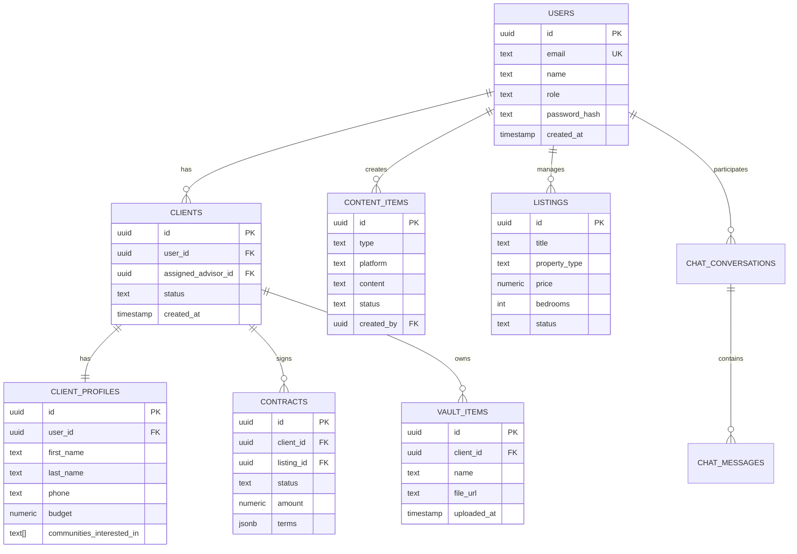

# ⚙️ DarieAI - Installation & Configuration Guide

> **Complete setup guide for development and production environments**

---

## 📋 Table of Contents

- [Prerequisites](#-prerequisites)
- [Development Setup](#-development-setup)
- [Environment Variables](#-environment-variables)
- [Database Configuration](#-database-configuration)
- [API Keys Setup](#-api-keys-setup)
- [Running the Application](#-running-the-application)
- [Build and Deploy](#-build-and-deploy)

---

## 📦 Prerequisites

### Required Software

| Software | Minimum Version | Download Link |
|----------|----------------|---------------|
| Node.js | 18.0.0 | https://nodejs.org/ |
| npm | 9.0.0 | Included with Node.js |
| Git | 2.x | https://git-scm.com/ |

### Required Accounts

| Service | Purpose | Sign Up Link |
|---------|---------|--------------|
| Google Cloud Platform | Gemini AI + Maps API | https://console.cloud.google.com/ |
| Supabase | Database & Backend | https://supabase.com/ |
| Resend | Email OTP Service | https://resend.com/ |
| Twilio | SMS OTP Service | https://www.twilio.com/ |

### System Requirements

**Development**:
- OS: Windows 10+, macOS 10.15+, Ubuntu 20.04+
- RAM: 8 GB minimum, 16 GB recommended
- Storage: 2 GB free space
- Internet: Stable connection required

**Production**:
- Node.js hosting (Vercel, Netlify, or VPS)
- Supabase Pro plan (recommended for production)
- Custom domain with SSL

---

## 🚀 Development Setup

### Step 1: Clone Repository

```bash
# Using Git
git clone https://github.com/your-org/Darieai.git
cd Darieai

# Or download ZIP and extract
```

### Step 2: Install Dependencies

```bash
# Install all packages
npm install

# This installs:
# - React 19.2.0
# - TypeScript 5.8.2
# - Vite 6.2.0
# - Zustand 5.0.8
# - @google/genai 1.28.0
# - @supabase/supabase-js 2.39.0
# - And all other dependencies
```

**Installation Time**: 2-5 minutes depending on internet speed

**Verify Installation**:
```bash
# Check Node.js version
node --version
# Should output: v18.x.x or higher

# Check npm version
npm --version
# Should output: 9.x.x or higher

# Check installed packages
npm list --depth=0
```

### Step 3: Create Environment File

```bash
# Copy example file
cp .env.example .env

# Or create new file
touch .env
```

Edit `.env` file with your credentials (see [Environment Variables](#-environment-variables) section).

---

## 🔑 Environment Variables

### Frontend Variables (`.env`)

Create a `.env` file in the project root with the following variables:

```env
# =================================
# SUPABASE CONFIGURATION
# =================================
VITE_SUPABASE_URL=https://your-project.supabase.co
VITE_SUPABASE_ANON_KEY=your-supabase-anon-key-here

# =================================
# GOOGLE AI CONFIGURATION
# =================================
VITE_GEMINI_API_KEY=your-gemini-api-key-here
API_KEY=your-gemini-api-key-here

# =================================
# GOOGLE MAPS CONFIGURATION
# =================================
VITE_GOOGLE_API_KEY=your-google-maps-api-key-here
VITE_GOOGLE_MAPS_API_KEY=your-google-maps-api-key-here

# =================================
# OPTIONAL: DEVELOPMENT SETTINGS
# =================================
VITE_DEV_MODE=true
VITE_LOG_LEVEL=debug
```

### Backend Variables (Supabase Secrets)

These are configured in Supabase Dashboard, **NOT** in `.env`:

```bash
# Email Service (Resend)
RESEND_API_KEY=re_xxxxxxxxxxxxxxxxxxxx

# SMS Service (Twilio)
TWILIO_ACCOUNT_SID=ACxxxxxxxxxxxxxxxxxxxxxxxxxxxxxxxx
TWILIO_AUTH_TOKEN=your_twilio_auth_token_here
TWILIO_PHONE_NUMBER=+1234567890

# Supabase (Auto-configured in Edge Functions)
SUPABASE_URL=https://your-project.supabase.co
SUPABASE_ANON_KEY=your-anon-key
SUPABASE_SERVICE_ROLE_KEY=your-service-role-key
```

---

## 🗄️ Database Configuration

### Option A: Automated Setup (Supabase CLI)

**Step 1: Install Supabase CLI**
```bash
npm install -g supabase
```

**Step 2: Login to Supabase**
```bash
supabase login
```
This opens browser for authentication.

**Step 3: Link Project**
```bash
# Get your project ref from Supabase Dashboard
# URL format: https://[project-ref].supabase.co

supabase link --project-ref your-project-ref
```

**Step 4: Apply Migrations**
```bash
# Apply all migrations in order
supabase db push

# This runs all files in supabase/migrations/ folder
```

**Step 5: Deploy Edge Functions**
```bash
# Deploy all functions
supabase functions deploy

# Or deploy individually
supabase functions deploy generate-client-otp
supabase functions deploy verify-client-otp
supabase functions deploy unified-login
supabase functions deploy staff-register
supabase functions deploy change-password
```

**Step 6: Set Secrets**
```bash
# Set email API key
supabase secrets set RESEND_API_KEY=re_your_key

# Set Twilio credentials
supabase secrets set TWILIO_ACCOUNT_SID=ACxxxxxxxxxx
supabase secrets set TWILIO_AUTH_TOKEN=your_token
supabase secrets set TWILIO_PHONE_NUMBER=+1234567890
```

---

### Option B: Manual Setup (Supabase Dashboard)

**Step 1: Create Supabase Project**
1. Go to https://supabase.com/dashboard
2. Click "New Project"
3. Enter:
   - Name: DarieAI
   - Database Password: (strong password)
   - Region: Choose closest to Dubai (Asia Southeast - Singapore)
4. Wait 2-3 minutes for provisioning

**Step 2: Run Migrations**
1. Go to SQL Editor in Supabase Dashboard
2. Click "New Query"
3. Copy content from each migration file (in order):

**Migration 1**: `20251104084110_create_real_estate_schema.sql`
```sql
-- Create users table
CREATE TABLE users (
    id UUID PRIMARY KEY DEFAULT gen_random_uuid(),
    email TEXT UNIQUE NOT NULL,
    name TEXT,
    role TEXT CHECK (role IN ('Owner', 'Admin', 'Property Advisor', 'Client')),
    password_hash TEXT,
    avatar TEXT,
    phone TEXT,
    temp_password TEXT,
    temp_password_expires_at TIMESTAMP,
    force_password_change BOOLEAN DEFAULT false,
    created_at TIMESTAMP DEFAULT NOW(),
    updated_at TIMESTAMP DEFAULT NOW()
);

-- Enable RLS
ALTER TABLE users ENABLE ROW LEVEL SECURITY;

-- RLS Policy: Users can view their own data
CREATE POLICY "Users can view own data"
    ON users FOR SELECT
    USING (auth.uid() = id);

-- Continue with rest of schema...
```

4. Run the query
5. Repeat for all 6 migration files

**Migration Order**:
1. `20251104084110_create_real_estate_schema.sql`
2. `20251104095259_add_global_real_estate_tables.sql`
3. `20251104103319_add_client_otp_authentication.sql`
4. `20251104175918_add_client_profile_information.sql`
5. `20251104181410_add_staff_authentication_system.sql`
6. `20251104182101_add_client_password_authentication.sql`

**Step 3: Verify Tables Created**
1. Go to Table Editor
2. Verify these tables exist:
   - users
   - clients
   - client_profiles
   - client_otp_verifications
   - listings
   - contracts
   - content_items
   - master_prompts
   - chat_conversations
   - chat_messages
   - vault_items

**Step 4: Deploy Edge Functions Manually**
1. Go to Edge Functions section
2. Click "Deploy new function"
3. For each function in `supabase/functions/`:
   - Upload the folder
   - Configure environment variables
   - Deploy

**Functions to Deploy**:
- generate-client-otp
- verify-client-otp
- client-login
- staff-login
- unified-login
- staff-register
- change-password
- request-password-reset
- reset-password

**Step 5: Configure Secrets**
1. Go to Settings > Edge Functions > Secrets
2. Add each secret:
   - Name: RESEND_API_KEY
   - Value: re_your_key
3. Repeat for Twilio secrets

---

### Database Schema Overview



---

## 🔑 API Keys Setup

### 1. Google Gemini AI API Key

**Step-by-Step**:

1. **Create Google Cloud Project**
   - Go to https://console.cloud.google.com/
   - Click "Select a project" → "New Project"
   - Name: "DarieAI"
   - Click "Create"

2. **Enable Gemini API**
   - Go to https://makersuite.google.com/app/apikey
   - Sign in with Google account
   - Click "Create API Key"
   - Select your project
   - Click "Create API key in existing project"

3. **Copy API Key**
   - Copy the generated key
   - Add to `.env`:
     ```env
     VITE_GEMINI_API_KEY=AIza...
     API_KEY=AIza...
     ```

4. **Configure Billing** (Optional for production)
   - Go to Billing section
   - Add payment method
   - Set budget alerts

**Free Tier Limits**:
- 60 requests per minute
- 1,500 requests per day
- Suitable for development and testing

**Pricing** (if exceeded free tier):
- Text generation: $0.00125 per 1K characters
- Audio streaming: $0.0005 per minute

---

### 2. Google Maps Platform API Key

**Step-by-Step**:

1. **Enable Required APIs**
   - Go to https://console.cloud.google.com/
   - Select your project
   - Go to "APIs & Services" → "Library"
   - Enable these APIs:
     - ✅ Maps JavaScript API
     - ✅ Maps SDK for Android (if mobile app planned)
     - ✅ Places API (New)
     - ✅ Geocoding API
     - ✅ Map Tiles API

2. **Create API Key**
   - Go to "Credentials"
   - Click "Create Credentials" → "API Key"
   - Copy the generated key

3. **Restrict API Key** (Important for Security)
   
   **For Development**:
   - Application restrictions: HTTP referrers
   - Add: `http://localhost:*/*`
   
   **For Production**:
   - Application restrictions: HTTP referrers
   - Add: `https://yourdomain.com/*`
   
   **API restrictions**:
   - Restrict key to selected APIs
   - Select only the enabled APIs above

4. **Add to Environment**
   ```env
   VITE_GOOGLE_API_KEY=AIza...
   VITE_GOOGLE_MAPS_API_KEY=AIza...
   ```

5. **Enable Billing**
   - Go to Billing
   - Link billing account
   - Set budget alert: $50, $100, $200

**Free Tier**:
- $200 credit per month
- Covers ~28,000 map loads or ~40,000 API calls

**Pricing** (after $200 credit):
- 3D Maps: $7 per 1,000 map loads
- Places API: $17 per 1,000 requests
- Geocoding: $5 per 1,000 requests

---

### 3. Supabase Credentials

**Already have from database setup**:

1. **Get Project URL**
   - Supabase Dashboard → Settings → API
   - Copy "Project URL"
   - Example: `https://abcdefgh.supabase.co`

2. **Get Anon Key**
   - Same page
   - Copy "anon public" key (NOT service_role)
   - This key is safe to use in frontend

3. **Add to Environment**
   ```env
   VITE_SUPABASE_URL=https://your-project.supabase.co
   VITE_SUPABASE_ANON_KEY=eyJhbGci...
   ```

**Note**: Never expose `service_role` key in frontend!

---

### 4. Resend API Key (Email OTP)

**Step-by-Step**:

1. **Sign Up**
   - Go to https://resend.com/
   - Click "Start for free"
   - Sign up with email

2. **Verify Email Domain** (Production only)
   - Dashboard → Domains → Add Domain
   - Enter: `yourdomain.com`
   - Add DNS records (provided by Resend)
   - Wait for verification (~5 minutes)
   
   **For Development**: Use `resend.dev` domain (pre-verified)

3. **Create API Key**
   - Dashboard → API Keys
   - Click "Create API Key"
   - Name: "DarieAI Production"
   - Copy key: `re_123abc...`

4. **Add to Supabase Secrets** (NOT .env)
   ```bash
   supabase secrets set RESEND_API_KEY=re_123abc...
   ```

**Free Tier**:
- 100 emails per day
- 3,000 emails per month
- Sufficient for testing

**Pricing**:
- $20/month for 50,000 emails

---

### 5. Twilio Credentials (SMS OTP)

**Step-by-Step**:

1. **Sign Up**
   - Go to https://www.twilio.com/try-twilio
   - Sign up for free trial
   - Get $15 credit

2. **Get Credentials**
   - Console → Account → Settings
   - Copy:
     - Account SID: `AC123...`
     - Auth Token: `abc123...`

3. **Get Phone Number**
   - Console → Phone Numbers → Manage → Buy a number
   - Search for numbers in desired country
   - Buy number (uses trial credit)
   - Copy number: `+1234567890`

4. **Add to Supabase Secrets**
   ```bash
   supabase secrets set TWILIO_ACCOUNT_SID=AC123...
   supabase secrets set TWILIO_AUTH_TOKEN=abc123...
   supabase secrets set TWILIO_PHONE_NUMBER=+1234567890
   ```

5. **Verify Test Numbers** (Trial Account)
   - Console → Phone Numbers → Verified Caller IDs
   - Add test phone numbers
   - Trial accounts can only send to verified numbers

**Free Trial**:
- $15 credit
- Can send ~2,000 SMS messages
- Must verify recipient numbers

**Pricing** (after trial):
- SMS: $0.0075 per message (US)
- Phone number: $1.15/month

---

## 🏃 Running the Application

### Development Mode

```bash
# Start development server
npm run dev

# Output:
# VITE v6.2.0  ready in 450 ms
# ➜  Local:   http://localhost:3000/
# ➜  Network: http://192.168.1.100:3000/
```

**Features in Dev Mode**:
- Hot Module Replacement (HMR)
- Source maps for debugging
- Error overlay
- Fast refresh

**Access the Application**:
- Local: http://localhost:3000
- Network: http://[your-ip]:3000

### Production Build

```bash
# Build for production
npm run build

# Output:
# vite v6.2.0 building for production...
# ✓ 1234 modules transformed.
# dist/index.html                   0.45 kB
# dist/assets/index-abc123.js     234.56 kB
# dist/assets/index-def456.css     12.34 kB
# ✓ built in 15.23s
```

### Preview Production Build

```bash
# Preview production build locally
npm run preview

# Output:
# ➜  Local:   http://localhost:4173/
```

**Verify Build**:
- Check `dist/` folder created
- Test all features work
- Check console for errors
- Verify API calls succeed

---

## 🐛 Common Setup Issues

### Issue 1: "Module not found" errors

**Solution**:
```bash
# Clear node_modules and reinstall
rm -rf node_modules
rm package-lock.json
npm install
```

### Issue 2: "VITE_X is not defined"

**Solution**:
- Ensure variable starts with `VITE_`
- Restart dev server after adding variables
- Check `.env` file is in project root

### Issue 3: Supabase connection fails

**Solution**:
```bash
# Test connection
curl https://your-project.supabase.co/rest/v1/ \
  -H "apikey: your-anon-key"

# Should return:
# {"message":"Welcome to PostgREST"}
```

### Issue 4: Maps not loading

**Solution**:
- Check API key is correct
- Verify Maps JavaScript API is enabled
- Check browser console for specific error
- For development, allow `localhost` in API restrictions

### Issue 5: Voice not working

**Solution**:
- Grant microphone permission in browser
- Use HTTPS in production (localhost allowed in dev)
- Check browser compatibility (Chrome/Edge recommended)

---

## ✅ Setup Verification Checklist

- [ ] Node.js 18+ installed
- [ ] npm 9+ installed
- [ ] Git installed (optional)
- [ ] `.env` file created with all variables
- [ ] Supabase project created
- [ ] Database migrations applied
- [ ] Edge functions deployed
- [ ] Supabase secrets configured
- [ ] Gemini API key obtained and added
- [ ] Google Maps API key obtained and added
- [ ] Resend API key configured
- [ ] Twilio credentials configured
- [ ] `npm install` completed successfully
- [ ] `npm run dev` starts without errors
- [ ] Application loads in browser
- [ ] Login page displays correctly
- [ ] Map assistant loads (if API keys correct)

---

Part 4: Installation & Configuration Guide. The document provides comprehensive setup instructions for both development and production environments.

