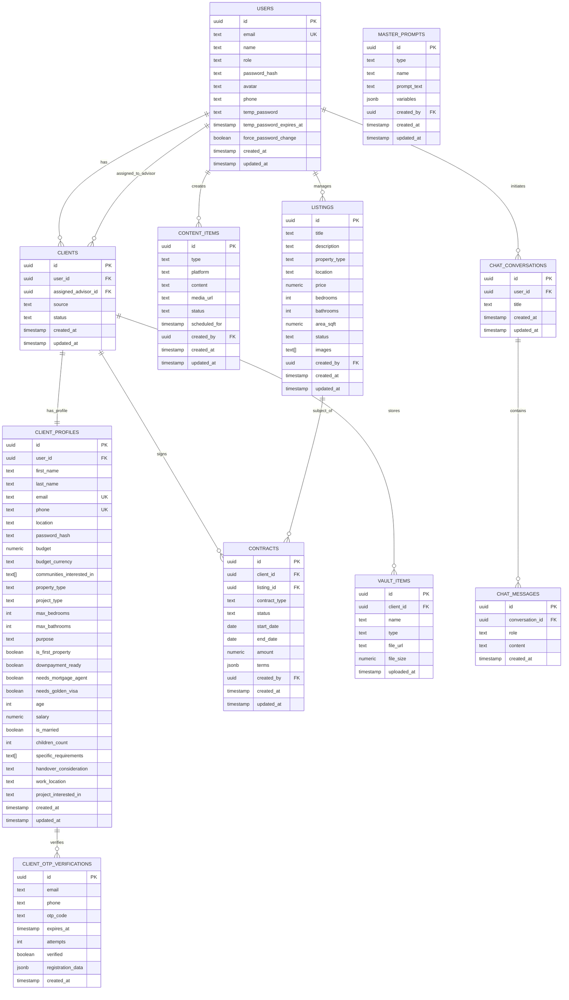

# 🗄️ DarieAI - Database Schema & API Documentation

> **Complete database schema, API endpoints, and integration documentation**

---

## 📋 Table of Contents

- [Database Schema](#database-schema)
- [Table Definitions](#table-definitions)
- [Row-Level Security Policies](#row-level-security-policies)
- [Edge Functions API](#edge-functions-api)
- [Gemini AI Integration](#gemini-ai-integration)
- [Google Maps Integration](#google-maps-integration)

---

## 🗃️ Database Schema

### Entity Relationship Diagram



---

## 📊 Table Definitions

### 1. users

**Purpose**: Store all system users (staff and clients)

```sql
CREATE TABLE users (
    id UUID PRIMARY KEY DEFAULT gen_random_uuid(),
    email TEXT UNIQUE NOT NULL,
    name TEXT,
    role TEXT CHECK (role IN ('Owner', 'Admin', 'Property Advisor', 'Client')),
    password_hash TEXT,
    avatar TEXT,
    phone TEXT,
    temp_password TEXT,
    temp_password_expires_at TIMESTAMP,
    force_password_change BOOLEAN DEFAULT false,
    created_at TIMESTAMP DEFAULT NOW(),
    updated_at TIMESTAMP DEFAULT NOW()
);

-- Indexes
CREATE INDEX idx_users_email ON users(email);
CREATE INDEX idx_users_role ON users(role);

-- RLS
ALTER TABLE users ENABLE ROW LEVEL SECURITY;
```

**Columns Explained**:
- `id`: Unique identifier (UUID)
- `email`: User's email address (must be unique)
- `name`: Display name
- `role`: User role (Owner, Admin, Property Advisor, Client)
- `password_hash`: Hashed password (bcrypt, 10 rounds)
- `avatar`: Avatar image URL or initials
- `phone`: Phone number
- `temp_password`: Temporary password for staff (expires in 24h)
- `temp_password_expires_at`: Expiry timestamp for temp password
- `force_password_change`: Flag to force password change on next login
- `created_at`: Account creation timestamp
- `updated_at`: Last update timestamp

**Sample Data**:
```sql
INSERT INTO users (email, name, role, password_hash) VALUES
('admin@Darieai.com', 'Admin User', 'Owner', '$2a$10$hashed_password_here'),
('advisor@Darieai.com', 'John Advisor', 'Property Advisor', '$2a$10$hashed_password_here');
```

---

### 2. clients

**Purpose**: Store client-specific data and advisor assignments

```sql
CREATE TABLE clients (
    id UUID PRIMARY KEY DEFAULT gen_random_uuid(),
    user_id UUID REFERENCES users(id) ON DELETE CASCADE,
    assigned_advisor_id UUID REFERENCES users(id) ON DELETE SET NULL,
    source TEXT,
    status TEXT DEFAULT 'Active' CHECK (status IN ('Active', 'Inactive', 'Converted', 'Lost')),
    created_at TIMESTAMP DEFAULT NOW(),
    updated_at TIMESTAMP DEFAULT NOW()
);

-- Indexes
CREATE INDEX idx_clients_user_id ON clients(user_id);
CREATE INDEX idx_clients_advisor_id ON clients(assigned_advisor_id);
CREATE INDEX idx_clients_status ON clients(status);

-- RLS
ALTER TABLE clients ENABLE ROW LEVEL SECURITY;
```

**Columns Explained**:
- `id`: Unique client identifier
- `user_id`: Reference to users table
- `assigned_advisor_id`: Reference to advisor in users table
- `source`: How client found service (Website, Referral, Social Media, etc.)
- `status`: Current status of client relationship
- `created_at`: When client was added
- `updated_at`: Last update timestamp

---

### 3. client_profiles

**Purpose**: Extended client information and preferences

```sql
CREATE TABLE client_profiles (
    id UUID PRIMARY KEY DEFAULT gen_random_uuid(),
    user_id UUID REFERENCES users(id) ON DELETE CASCADE,
    first_name TEXT,
    last_name TEXT,
    email TEXT UNIQUE,
    phone TEXT UNIQUE,
    location TEXT,
    password_hash TEXT,
    
    -- Property Preferences
    budget NUMERIC,
    budget_currency TEXT DEFAULT 'AED',
    communities_interested_in TEXT[],
    property_type TEXT,
    project_type TEXT,
    max_bedrooms INT,
    max_bathrooms INT,
    
    -- Investment Profile
    purpose TEXT CHECK (purpose IN ('own_use', 'investment', 'both')),
    is_first_property BOOLEAN DEFAULT true,
    downpayment_ready BOOLEAN DEFAULT false,
    needs_mortgage_agent BOOLEAN DEFAULT false,
    needs_golden_visa BOOLEAN DEFAULT false,
    
    -- Personal Details
    age INT,
    salary NUMERIC,
    is_married BOOLEAN,
    children_count INT DEFAULT 0,
    
    -- Requirements
    specific_requirements TEXT[],
    handover_consideration TEXT,
    work_location TEXT,
    project_interested_in TEXT,
    
    created_at TIMESTAMP DEFAULT NOW(),
    updated_at TIMESTAMP DEFAULT NOW()
);

-- Indexes
CREATE INDEX idx_client_profiles_user_id ON client_profiles(user_id);
CREATE INDEX idx_client_profiles_email ON client_profiles(email);
CREATE INDEX idx_client_profiles_budget ON client_profiles(budget);

-- RLS
ALTER TABLE client_profiles ENABLE ROW LEVEL SECURITY;
```

**Usage**:
- Stores detailed client information
- Separate password_hash from users table for security
- Auto-populated by AI profile extraction
- Used for personalized recommendations

---

### 4. client_otp_verifications

**Purpose**: Temporary storage for OTP verification during signup

```sql
CREATE TABLE client_otp_verifications (
    id UUID PRIMARY KEY DEFAULT gen_random_uuid(),
    email TEXT NOT NULL,
    phone TEXT,
    otp_code TEXT NOT NULL,
    expires_at TIMESTAMP NOT NULL,
    attempts INT DEFAULT 0,
    verified BOOLEAN DEFAULT false,
    registration_data JSONB,
    created_at TIMESTAMP DEFAULT NOW()
);

-- Indexes
CREATE INDEX idx_otp_email ON client_otp_verifications(email);
CREATE INDEX idx_otp_expires_at ON client_otp_verifications(expires_at);

-- Auto-delete expired OTPs (runs nightly)
CREATE OR REPLACE FUNCTION delete_expired_otps()
RETURNS void AS $$
BEGIN
    DELETE FROM client_otp_verifications
    WHERE expires_at < NOW() - INTERVAL '1 day';
END;
$$ LANGUAGE plpgsql;
```

**Flow**:
1. User submits registration form
2. System generates OTP and stores in this table
3. User receives OTP via email + SMS
4. User enters OTP
5. System verifies and creates account
6. OTP record deleted after successful verification

---

### 5. listings

**Purpose**: Property listings managed by staff

```sql
CREATE TABLE listings (
    id UUID PRIMARY KEY DEFAULT gen_random_uuid(),
    title TEXT NOT NULL,
    description TEXT,
    property_type TEXT CHECK (property_type IN ('Apartment', 'Villa', 'Townhouse', 'Penthouse', 'Office', 'Land')),
    location TEXT,
    price NUMERIC NOT NULL,
    bedrooms INT,
    bathrooms INT,
    area_sqft NUMERIC,
    status TEXT DEFAULT 'Available' CHECK (status IN ('Available', 'Reserved', 'Sold', 'Off Market')),
    images TEXT[],
    created_by UUID REFERENCES users(id),
    created_at TIMESTAMP DEFAULT NOW(),
    updated_at TIMESTAMP DEFAULT NOW()
);

-- Indexes
CREATE INDEX idx_listings_property_type ON listings(property_type);
CREATE INDEX idx_listings_status ON listings(status);
CREATE INDEX idx_listings_price ON listings(price);
CREATE INDEX idx_listings_location ON listings(location);

-- Full-text search
CREATE INDEX idx_listings_search ON listings USING GIN(to_tsvector('english', title || ' ' || COALESCE(description, '')));

-- RLS
ALTER TABLE listings ENABLE ROW LEVEL SECURITY;
```

---

### 6. contracts

**Purpose**: Contract management and tracking

```sql
CREATE TABLE contracts (
    id UUID PRIMARY KEY DEFAULT gen_random_uuid(),
    contract_number TEXT UNIQUE NOT NULL,
    client_id UUID REFERENCES clients(id) ON DELETE CASCADE,
    listing_id UUID REFERENCES listings(id) ON DELETE SET NULL,
    contract_type TEXT CHECK (contract_type IN ('Sale', 'Lease', 'Off-Plan')),
    status TEXT DEFAULT 'Draft' CHECK (status IN ('Draft', 'Pending', 'Signed', 'Completed', 'Cancelled')),
    start_date DATE,
    end_date DATE,
    amount NUMERIC NOT NULL,
    terms JSONB,
    created_by UUID REFERENCES users(id),
    created_at TIMESTAMP DEFAULT NOW(),
    updated_at TIMESTAMP DEFAULT NOW()
);

-- Auto-generate contract number
CREATE OR REPLACE FUNCTION generate_contract_number()
RETURNS TRIGGER AS $$
BEGIN
    NEW.contract_number := 'CNT-' || TO_CHAR(NOW(), 'YYYYMMDD') || '-' || LPAD(nextval('contract_seq')::TEXT, 4, '0');
    RETURN NEW;
END;
$$ LANGUAGE plpgsql;

CREATE SEQUENCE contract_seq;

CREATE TRIGGER set_contract_number
    BEFORE INSERT ON contracts
    FOR EACH ROW
    EXECUTE FUNCTION generate_contract_number();

-- Indexes
CREATE INDEX idx_contracts_client_id ON contracts(client_id);
CREATE INDEX idx_contracts_status ON contracts(status);
CREATE INDEX idx_contracts_created_by ON contracts(created_by);

-- RLS
ALTER TABLE contracts ENABLE ROW LEVEL SECURITY;
```

**Terms JSONB Structure**:
```json
{
  "payment_plan": "70/30",
  "down_payment": 700000,
  "installments": [
    { "date": "2025-02-01", "amount": 350000 },
    { "date": "2025-08-01", "amount": 350000 }
  ],
  "handover_date": "2025-12-31",
  "penalty_clause": "2% per month for late payment",
  "special_conditions": ["Parking space included", "Maintenance fee waived for 1 year"]
}
```

---

### 7. content_items

**Purpose**: Store AI-generated marketing content

```sql
CREATE TABLE content_items (
    id UUID PRIMARY KEY DEFAULT gen_random_uuid(),
    type TEXT NOT NULL CHECK (type IN ('Image', 'Video', 'Text')),
    platform TEXT CHECK (platform IN ('Instagram', 'Facebook', 'LinkedIn', 'Twitter', 'Email', 'SMS')),
    content TEXT NOT NULL,
    media_url TEXT,
    status TEXT DEFAULT 'Draft' CHECK (status IN ('Draft', 'Scheduled', 'Published', 'Archived')),
    scheduled_for TIMESTAMP,
    created_by UUID REFERENCES users(id),
    created_at TIMESTAMP DEFAULT NOW(),
    updated_at TIMESTAMP DEFAULT NOW()
);

-- Indexes
CREATE INDEX idx_content_type ON content_items(type);
CREATE INDEX idx_content_status ON content_items(status);
CREATE INDEX idx_content_scheduled ON content_items(scheduled_for);
CREATE INDEX idx_content_created_by ON content_items(created_by);

-- RLS
ALTER TABLE content_items ENABLE ROW LEVEL SECURITY;
```

---

### 8. vault_items

**Purpose**: Secure document storage metadata

```sql
CREATE TABLE vault_items (
    id UUID PRIMARY KEY DEFAULT gen_random_uuid(),
    client_id UUID REFERENCES clients(id) ON DELETE CASCADE,
    name TEXT NOT NULL,
    type TEXT CHECK (type IN ('Passport', 'Visa', 'Contract', 'Financial', 'Other')),
    file_url TEXT NOT NULL,
    file_size NUMERIC,
    uploaded_at TIMESTAMP DEFAULT NOW()
);

-- Indexes
CREATE INDEX idx_vault_client_id ON vault_items(client_id);
CREATE INDEX idx_vault_type ON vault_items(type);

-- RLS
ALTER TABLE vault_items ENABLE ROW LEVEL SECURITY;
```

**File Storage**: Files stored in Supabase Storage bucket with encryption

---

## 🔐 Row-Level Security Policies

### Users Table Policies

```sql
-- Policy: Users can view their own data
CREATE POLICY "users_select_own"
    ON users FOR SELECT
    USING (auth.uid() = id);

-- Policy: Users can update their own data
CREATE POLICY "users_update_own"
    ON users FOR UPDATE
    USING (auth.uid() = id);

-- Policy: Admins can view all users
CREATE POLICY "users_select_admin"
    ON users FOR SELECT
    USING (
        EXISTS (
            SELECT 1 FROM users
            WHERE id = auth.uid()
            AND role IN ('Owner', 'Admin')
        )
    );
```

### Clients Table Policies

```sql
-- Policy: Clients can view their own record
CREATE POLICY "clients_select_own"
    ON clients FOR SELECT
    USING (user_id = auth.uid());

-- Policy: Advisors can view assigned clients
CREATE POLICY "clients_select_assigned"
    ON clients FOR SELECT
    USING (assigned_advisor_id = auth.uid());

-- Policy: Admins can view all clients
CREATE POLICY "clients_select_admin"
    ON clients FOR SELECT
    USING (
        EXISTS (
            SELECT 1 FROM users
            WHERE id = auth.uid()
            AND role IN ('Owner', 'Admin')
        )
    );

-- Policy: Admins can insert clients
CREATE POLICY "clients_insert_admin"
    ON clients FOR INSERT
    WITH CHECK (
        EXISTS (
            SELECT 1 FROM users
            WHERE id = auth.uid()
            AND role IN ('Owner', 'Admin', 'Property Advisor')
        )
    );
```

### Client Profiles Table Policies

```sql
-- Policy: Clients can view own profile
CREATE POLICY "profiles_select_own"
    ON client_profiles FOR SELECT
    USING (user_id = auth.uid());

-- Policy: Clients can update own profile
CREATE POLICY "profiles_update_own"
    ON client_profiles FOR UPDATE
    USING (user_id = auth.uid());

-- Policy: Assigned advisors can view client profile
CREATE POLICY "profiles_select_advisor"
    ON client_profiles FOR SELECT
    USING (
        EXISTS (
            SELECT 1 FROM clients
            WHERE clients.user_id = client_profiles.user_id
            AND clients.assigned_advisor_id = auth.uid()
        )
    );
```

### Contracts Table Policies

```sql
-- Policy: Clients can view their own contracts
CREATE POLICY "contracts_select_own"
    ON contracts FOR SELECT
    USING (
        client_id IN (
            SELECT id FROM clients WHERE user_id = auth.uid()
        )
    );

-- Policy: Only Owner/Admin can create contracts
CREATE POLICY "contracts_insert_admin"
    ON contracts FOR INSERT
    WITH CHECK (
        EXISTS (
            SELECT 1 FROM users
            WHERE id = auth.uid()
            AND role IN ('Owner', 'Admin')
        )
    );
```

### Vault Items Table Policies

```sql
-- Policy: Clients can only access their own documents
CREATE POLICY "vault_select_own"
    ON vault_items FOR SELECT
    USING (
        client_id IN (
            SELECT id FROM clients WHERE user_id = auth.uid()
        )
    );

-- Policy: Clients can upload documents
CREATE POLICY "vault_insert_own"
    ON vault_items FOR INSERT
    WITH CHECK (
        client_id IN (
            SELECT id FROM clients WHERE user_id = auth.uid()
        )
    );

-- Policy: Clients can delete their own documents
CREATE POLICY "vault_delete_own"
    ON vault_items FOR DELETE
    USING (
        client_id IN (
            SELECT id FROM clients WHERE user_id = auth.uid()
        )
    );
```

---

## 🔌 Edge Functions API

### 1. generate-client-otp

**Endpoint**: `POST /functions/v1/generate-client-otp`

**Purpose**: Generate and send OTP for client registration

**Request Body**:
```json
{
  "email": "user@example.com",
  "phone": "+971501234567",
  "firstName": "John",
  "lastName": "Doe",
  "location": "Dubai",
  "password": "SecurePass123!"
}
```

**Response Success** (200):
```json
{
  "success": true,
  "message": "OTP sent to email and phone",
  "verification_id": "550e8400-e29b-41d4-a716-446655440000"
}
```

**Response Error** (400):
```json
{
  "success": false,
  "error": "Email already exists"
}
```

**Implementation**:
```typescript
// supabase/functions/generate-client-otp/index.ts
import { serve } from 'https://deno.land/std@0.168.0/http/server.ts';
import { createClient } from '@supabase/supabase-js';

serve(async (req) => {
  const { email, phone, firstName, lastName, location, password } = await req.json();
  
  // Generate OTP
  const otpCode = Math.floor(100000 + Math.random() * 900000).toString();
  const expiresAt = new Date(Date.now() + 10 * 60 * 1000); // 10 minutes
  
  // Store in database
  const { data, error } = await supabase
    .from('client_otp_verifications')
    .insert({
      email,
      phone,
      otp_code: otpCode,
      expires_at: expiresAt,
      registration_data: { firstName, lastName, location, password }
    })
    .select()
    .single();
  
  // Send email via Resend
  await sendEmailOTP(email, otpCode);
  
  // Send SMS via Twilio
  await sendSMSOTP(phone, otpCode);
  
  return new Response(JSON.stringify({
    success: true,
    message: 'OTP sent',
    verification_id: data.id
  }));
});
```

---

### 2. verify-client-otp

**Endpoint**: `POST /functions/v1/verify-client-otp`

**Purpose**: Verify OTP and create client account

**Request Body**:
```json
{
  "email": "user@example.com",
  "otp_code": "123456"
}
```

**Response Success** (200):
```json
{
  "success": true,
  "user_id": "550e8400-e29b-41d4-a716-446655440000",
  "email": "user@example.com",
  "message": "Registration successful"
}
```

**Response Error** (400):
```json
{
  "success": false,
  "error": "Invalid OTP code",
  "attempts_remaining": 3
}
```

---

### 3. unified-login

**Endpoint**: `POST /functions/v1/unified-login`

**Purpose**: Smart login that detects user type (client or staff)

**Request Body**:
```json
{
  "email": "user@example.com",
  "password": "SecurePass123!"
}
```

**Response Success - Client** (200):
```json
{
  "success": true,
  "user_type": "client",
  "user_id": "550e8400-e29b-41d4-a716-446655440000",
  "email": "user@example.com",
  "name": "John Doe",
  "role": "Client",
  "requires_password_change": false
}
```

**Response Success - Staff** (200):
```json
{
  "success": true,
  "user_type": "staff",
  "user_id": "550e8400-e29b-41d4-a716-446655440000",
  "email": "advisor@example.com",
  "name": "Jane Advisor",
  "role": "Property Advisor",
  "requires_password_change": false
}
```

**Response Error** (401):
```json
{
  "success": false,
  "error": "Invalid email or password"
}
```

---

### 4. staff-register

**Endpoint**: `POST /functions/v1/staff-register`

**Purpose**: Create new staff account (admin-authorized)

**Request Body**:
```json
{
  "admin_email": "admin@example.com",
  "admin_password": "AdminPass123!",
  "new_user": {
    "email": "newstaff@example.com",
    "name": "Jane Doe",
    "role": "Property Advisor",
    "phone": "+971501234567"
  }
}
```

**Response Success** (200):
```json
{
  "success": true,
  "user_id": "550e8400-e29b-41d4-a716-446655440000",
  "email": "newstaff@example.com",
  "temporary_password": "Temp123!Pass",
  "message": "Staff user created successfully"
}
```

**Response Error** (403):
```json
{
  "success": false,
  "error": "Unauthorized: Only Owner or Admin can create staff accounts"
}
```

---

### 5. change-password

**Endpoint**: `POST /functions/v1/change-password`

**Purpose**: Update user password

**Request Body**:
```json
{
  "user_id": "550e8400-e29b-41d4-a716-446655440000",
  "user_type": "client",
  "old_password": "OldPass123!",
  "new_password": "NewPass456!"
}
```

**Response Success** (200):
```json
{
  "success": true,
  "message": "Password updated successfully"
}
```

---

## 🤖 Gemini AI Integration

### Live API Connection

```typescript
import { MultimodalLiveClient } from '@google/genai';

const client = new MultimodalLiveClient({
  apiKey: GEMINI_API_KEY,
  model: 'gemini-2.5-flash-native-audio-preview',
  config: {
    generationConfig: {
      responseModalities: 'audio',
      speechConfig: {
        voiceConfig: {
          prebuiltVoiceConfig: {
            voiceName: 'Zephyr'
          }
        }
      }
    },
    systemInstruction: SYSTEM_PROMPT,
    tools: [
      { functionDeclarations: [locateCommunityTool] },
      { functionDeclarations: [findProjectsTool] },
      { functionDeclarations: [mapsGroundingTool] },
      { functionDeclarations: [updateClientProfileTool] }
    ]
  }
});

// Connect
await client.connect();

// Send audio
client.sendAudio(audioData); // 16kHz PCM

// Receive responses
client.on('content', (data) => {
  console.log('Response:', data.modelTurn.parts);
});

client.on('audioData', (data) => {
  // Play audio response
  audioStreamer.addPCM16(data);
});

// Handle tool calls
client.on('toolCall', async (call) => {
  const result = await executeToolFunction(call.name, call.args);
  client.sendToolResponse({
    id: call.id,
    response: result
  });
});
```

### Content Generation API

```typescript
const ai = new GoogleGenAI({ apiKey: GEMINI_API_KEY });

const response = await ai.models.generateContent({
  model: 'gemini-2.5-flash-latest',
  contents: prompt,
});

const text = response.text;
```

---

## 🗺️ Google Maps Integration

### Maps Grounding API

```typescript
const response = await fetch(
  'https://generativelanguage.googleapis.com/v1beta/models/gemini-2.5-flash-latest:generateContent',
  {
    method: 'POST',
    headers: {
      'Content-Type': 'application/json',
      'x-goog-api-key': GEMINI_API_KEY
    },
    body: JSON.stringify({
      contents: [{ parts: [{ text: query }] }],
      tools: [{
        googleSearchRetrieval: {
          dynamicRetrievalConfig: {
            mode: 'MODE_DYNAMIC',
            dynamicThreshold: 0.3
          }
        }
      }]
    })
  }
);

const data = await response.json();
const groundingChunks = data.candidates[0].groundingMetadata?.groundingChunks || [];
```

### Places API (New)

```typescript
const response = await fetch(
  `https://places.googleapis.com/v1/places/${placeId}`,
  {
    headers: {
      'Content-Type': 'application/json',
      'X-Goog-Api-Key': GOOGLE_MAPS_API_KEY,
      'X-Goog-FieldMask': 'id,displayName,formattedAddress,location,rating'
    }
  }
);

const place = await response.json();
```

### Geocoding API

```typescript
const geocoder = new google.maps.Geocoder();
const result = await geocoder.geocode({
  address: 'Dubai Marina, Dubai, UAE'
});

const location = result.results[0].geometry.location;
```

---

Part 5: Database Schema & API Documentation. The document provides complete database structure, RLS policies, and API endpoint documentation.

